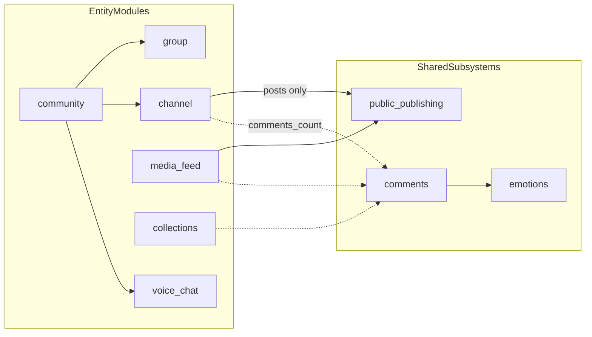

# Социальные сущности — индекс

> **Статус:** `done` · **Версия:** 0.3 · **Дата:** 2026-07-13  
> **Роль:** карта связей, общие правила и границы ownership. Детали — в профильных файлах ниже.

## Профильные документы

| Сущность | Документ | Владеет |
|----------|----------|---------|
| Сообщество | [community.md](./community.md) | контейнер, подписка, attach/detach дочерних объектов |
| Группа | [group.md](./group.md) | переписка, membership, GK (private) |
| Канал | [channel.md](./channel.md) | **только посты**; обсуждение — через Comments |
| Аудиочат | [audio-chat.md](./audio-chat.md) | голосовая комната, LiveKit ACL |
| **Виртуальный пользователь (ВП)** | [virtual-user.md](./virtual-user.md) | обычный `users`; owner, operators, transfer; окно 4 |
| **Bot Application** | [bot-application.md](./bot-application.md) | автоматизация group/channel/community; окно 4; без `user_id` |

## Общие подсистемы (полиморфные)

| Подсистема | target_type | Документ / UI |
|------------|-------------|---------------|
| **Comments** | `post`, `media`, `collection_item` | [15-comments.md](../../doc_UI/15-comments.md) |
| **Emotions** + RatingCounters | `post`, `media`, `comment`, message, … | [18-content-actions.md](../../doc_UI/18-content-actions.md) — шкала 9, рейтинг «+/−» |
| **Recommendations** | public post, media, … | [18-content-actions.md](../../doc_UI/18-content-actions.md), [feed-ranking.md](../../04-data/feed-ranking.md) |
| **Attributes / Genres** | posts, feeds, search | [34-attributes-genres.md](../../doc_UI/34-attributes-genres.md), [feed-ranking.md](../../04-data/feed-ranking.md) |
| **Favorites (shelves)** | public / private | [14-personal-page.md](../../doc_UI/14-personal-page.md), [feed-ranking.md](../../04-data/feed-ranking.md) §2 |
| **PublicPublishing** | drafts, schedule | [37-content-editor.md](../../doc_UI/37-content-editor.md), [32-channel-editor.md](../../doc_UI/32-channel-editor.md), [33-media-editor.md](../../doc_UI/33-media-editor.md) |
| MembershipRoles | per-entity | профильные файлы |
| Invites / QR | per-entity | [28-qr-invites.md](../../doc_UI/28-qr-invites.md) |
| CatalogFolders | client-only | [04-news-window.md](../../doc_UI/04-news-window.md) |
| Reports | polymorphic | [27-security-privacy.md](../../doc_UI/27-security-privacy.md) |
| **SocialInboxProjection** | window 4 | [10-free-communication.md](../../doc_UI/10-free-communication.md) — `inbox_threads`, `inbox_events`, appeals |
| **VirtualUserAccess** | ownership, operators, keys, transfer | [virtual-user.md](./virtual-user.md) |
| **BotPlatform** | apps, installations, webhooks, updates | [bot-application.md](./bot-application.md) |

## Карта модулей

## Общие правила (не дублировать в профильных файлах)

1. **Подписка на сообщество ≠ доступ** ко всем дочерним объектам.
2. **Папка каталога ≠ сообщество** — только клиентская организация ссылок.
3. **Тип шифрования** задаётся дочерним объектом, не контейнером ([content-security-matrix.md](../content-security-matrix.md)).
4. **Канал = только посты** — нет чат-потока; обсуждение в треде Comments к посту.
5. **Comments** — только публичный контур; E2E-группы используют message threads.
6. **Формат контента:** `DocumentV2` без offsets/placeholders; редактирование создаёт immutable revision ([public-content-format.md](../public-content-format.md)).
7. **ВП** — обычный `user_id`; без `member_type` / `author_type`; специфика только в [virtual-user.md](./virtual-user.md).
8. **Bot Application** — не `users`; пишет только от имени group/channel/community в окно 4; см. [bot-application.md](./bot-application.md).
9. **Сущности не пишут в личку** — сообщения пользователю только карточками окна 4 (`entity_message`, appeals); окно 1 — human ↔ human (включая ВП).

## Иерархия принадлежности

| Объект | `community_id` |
|--------|----------------|
| Группа / канал | Опционально |
| Аудиочат | **Обязательно** (auto-create при отсутствии) |

## Связанные документы

- [communities-groups-channels.md](../communities-groups-channels.md) — редирект-индекс (legacy path)
- [communities.md](../communities.md) — канон ACL и жизненный цикл сообществ
- [public-content-format.md](../public-content-format.md)
- [glossary.md](../glossary.md)
- [data-model.md](../../04-data/data-model.md)
- [backend-services.md](../../02-architecture/backend-services.md)
