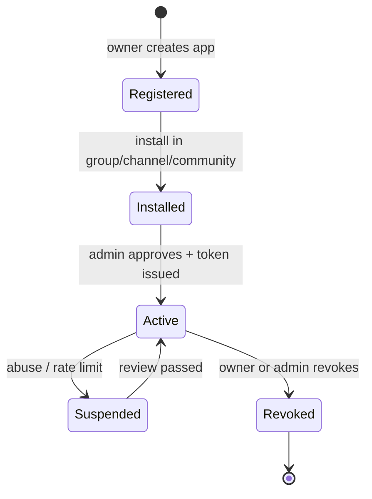

# Bot Application (автоматизация социального объекта)

> **Статус:** `done` · **Версия:** 0.3 · **Дата:** 2026-07-13  
> **Индекс:** [00-index.md](./00-index.md)

## Назначение

**Bot Application** — техническая автоматизация, установленная в группу, канал или сообщество. Приложение выполняет действия **только от имени этого социального объекта** и не имеет собственной публичной личности, профиля, `@username` или `user_id`.

Bot Application **не является**:
- виртуальным пользователем (ВП);
- human-аккаунтом;
- отдельным отправителем в UI.

## Модель данных (концептуально)

| Сущность | Описание |
|----------|----------|
| `bot_applications` | Регистрация приложения; владелец = human `owner_user_id` |
| `bot_tokens` | Токены доступа (hash-only на сервере) |
| `bot_installations` | Привязка app к **одному** social object: `group`, `channel` или `community` |
| `bot_webhooks` | URL доставки updates |
| `bot_commands` | Команды в контексте установки |
| `bot_audit_log` | Технический audit: `app_id`, `installation_id`, `method`, `actor_user_id` (owner) |

**Не создавать:** `bot_identities`, `users.account_type=bot`.

## Установка (Installation)

| Поле | Значение |
|------|----------|
| `installation_id` | UUID установки |
| `app_id` | UUID приложения |
| `target_type` | `group` \| `channel` \| `community` |
| `target_id` | UUID группы, канала или сообщества |
| `capabilities` | deny-by-default scopes (см. [bot-api.md](../../05-api/bot-api.md)) |
| `status` | `active` \| `suspended` \| `revoked` |

Одна установка = ровно один social object. Cross-object действия запрещены.

## Инварианты авторства

1. Bot API принимает обязательный `installation_id` (и при необходимости `target_id` для валидации).
2. Сервер **сам** определяет `author_id` = `group_id`, `channel_id` или `community_id` из установки.
3. Клиент **не может** передать произвольный `author_id`, `sender_id`, ВП или human identity.
4. В UI и публичном контенте автор — только social object; `app_id` виден только в audit/provenance.

## Инварианты доставки

| Тип контента | Куда попадает |
|--------------|---------------|
| Пост канала / медиа-лента | Публичная лента / канал |
| Сообщение в public group | Групповой чат (plaintext) |
| Комментарий | Comments subsystem |
| **Адресное сообщение** (`entity_message`) от группы/канала/сообщества | **Окно 4** (`SocialInboxProjection` → `inbox_events`), **не** окно 1 личных чатов |

Карточки `entity_message` создают событие `event_type=entity_message` в read model окна 4; автор в UI = group/channel/community. Private/E2E чат **не создаётся**. В MVP (без Bot API) те же карточки шлют владельцы/админы сущности через `POST /inbox/notify`; с Bot API — метод `notifyUser`.

## Запрещённые действия

| Действие | Код ошибки |
|----------|------------|
| Отправка в личный чат (1:1) | `BOT_PRIVATE_MESSAGING_FORBIDDEN` |
| Действие от собственного имени бота | `BOT_AUTHOR_FORBIDDEN` |
| Действие вне установки / подмена target | `INSTALLATION_TARGET_MISMATCH` |
| E2E envelope path | `BOT_E2E_FORBIDDEN` |
| Звонки | `BOT_CALLS_FORBIDDEN` |
| Создание ВП / acting as VP | `BOT_VP_FORBIDDEN` |

## Отличие от ВП

| | Virtual User (ВП) | Bot Application |
|---|---|---|
| Модель | `users` с `account_type=virtual` | `bot_applications` + `bot_installations` |
| Публичная личность | Да (`@username`, профиль) | **Нет** — только social object |
| Личные чаты 1:1 | **Разрешены** (E2E, операторы) | **Запрещены** |
| Адресные сообщения | В окно 4 как DM к ВП | В окно 4 от имени group/channel/community |
| Управление | owner + operators (люди) | owner (разработчик) + API token |
| Крипто | E2E envelope + wrapped keys | Только public plaintext path |
| Звонки | Запрещены MVP | Запрещены |

См. [virtual-user.md](./virtual-user.md), [ADR-0009](../../adr/0009-native-bot-app-platform.md).

## Lifecycle

| UI state | `bot_installations.status` | Notes |
|----------|---------------------------|-------|
| Registered | — (app only, no install row) | `bot_applications` created |
| Installed (pending) | `pending` | Awaiting admin approval |
| Active | `active` | Token issued, webhooks enabled |
| Suspended | `suspended` | Rate limit / abuse |
| Revoked | `revoked` | Terminal |

## Capabilities (scopes, deny-by-default)

| Scope | Описание |
|-------|----------|
| `post:channel` | Публикация постов в канале установки |
| `post:media` | Публикация в медиа-ленту (если community scope) |
| `message:group` | Сообщения в public group установки |
| `notify` | Карточки `entity_message` в окно 4 (`notifyUser`) |
| `comment:write` | Комментарии к постам |
| `emotion:write` | Реакции |
| `callback:answer` | Ответ на callback query |
| `command:manage` | Управление командами |
| `webhook:manage` | setWebhook / getWebhookInfo |

## Updates (входящие события)

Приложение получает updates через **webhook** (primary) или **long polling** (fallback):

- `message` — входящее в public group
- `comment` — новый комментарий
- `callback_query` — нажатие inline-кнопки
- `entity_message_reply` — ответ пользователя на карточку `entity_message` в окне 4
- `installation` — изменение установки

См. [bot-updates.md](../../05-api/bot-updates.md).

## UI

- Установка приложения: настройки группы/канала/сообщества (post-MVP UI spec)
- Карточки окна 4 от group/channel/community: [10-free-communication.md](../../doc_UI/10-free-communication.md)
- Provenance «через приложение X» — только в audit, не в публичном авторе

## Data / API

- Таблицы: см. [data-model.md](../../04-data/data-model.md) § Bot Platform
- REST Bot API: [bot-api.md](../../05-api/bot-api.md)
- Архитектура: [bot-platform.md](../../02-architecture/bot-platform.md)

## История

| Версия | Дата | Изменение |
|--------|------|-----------|
| 0.2 | 2026-07-13 | merge doc_ver2 этап 5: `entity_message`, scope `notify`, `notifyUser`; installation-only без `user_id` |
| 0.1 | 2026-07-12 | Первый draft: installation-only author, окно 4 delivery, отличие от ВП |
