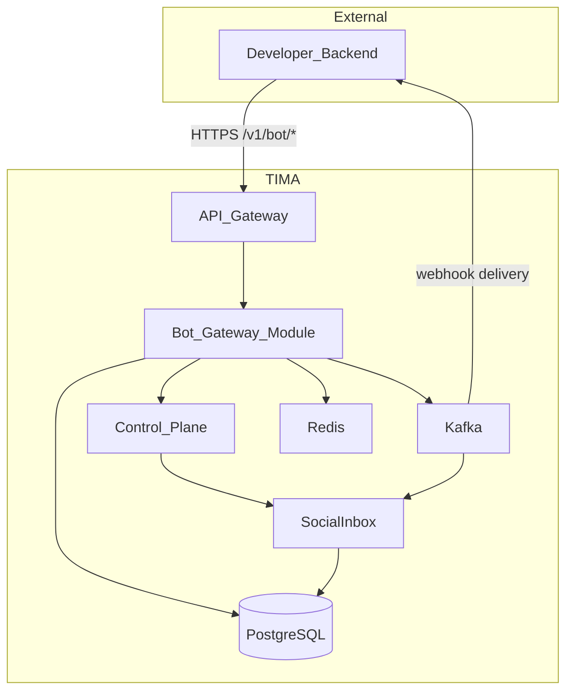
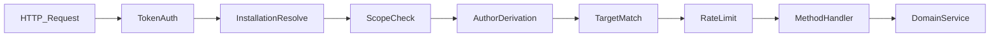
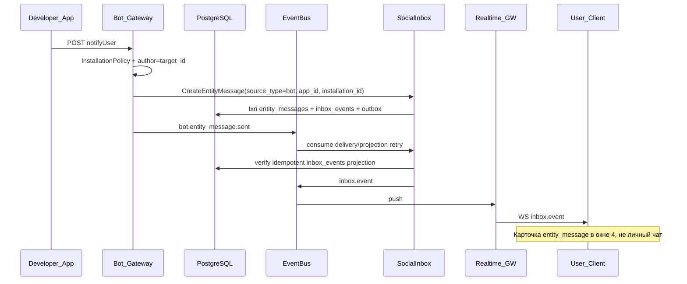
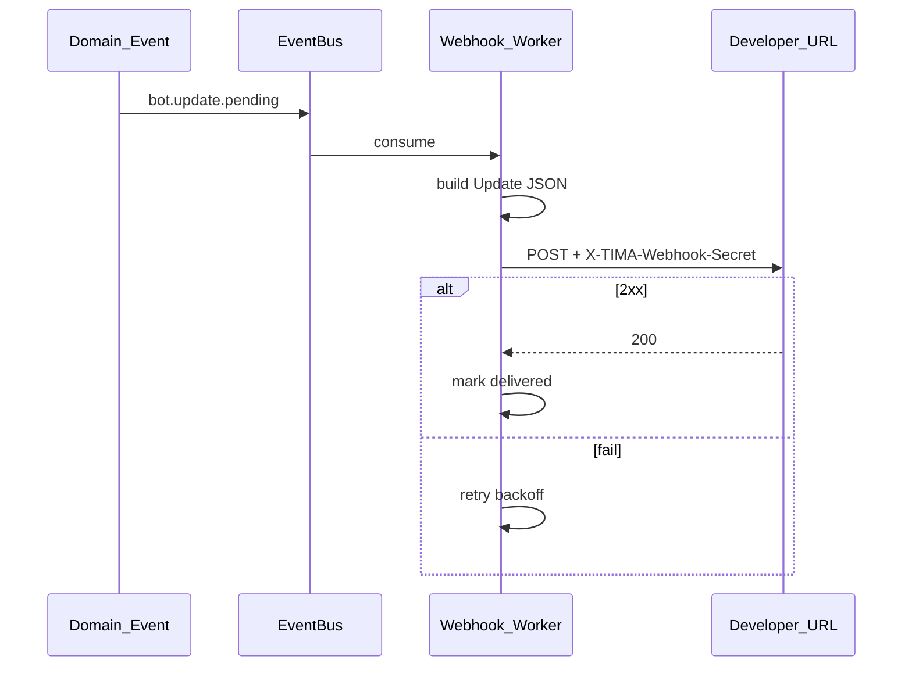

# Bot Platform — архитектура

> **Статус:** `done` (spec) · **Версия:** 0.3 · **Дата:** 2026-07-13 · **Реализация:** Phase 3b

## 1. Назначение

Модуль **BotPlatform** предоставляет Developer API для сторонних автоматизаций: регистрация приложений, установка в social object, выполнение методов от имени группы/канала/сообщества, доставка updates через webhook/long polling.

**Не входит:** user JWT API, E2E messaging, Virtual User management. Бот **не имеет** `user_id` — только `app_id` + `installation_id` (provenance/audit).

## 2. Контейнер (C4)

## 3. Компоненты

| Компонент | Технология | Ответственность |
|-----------|------------|-----------------|
| **Bot Gateway** | Go (модуль monolith) | Auth bot token, method router, policy middleware |
| **App Registry** | PostgreSQL | `bot_applications`, `bot_installations`, `bot_tokens` |
| **Token Service** | PostgreSQL + Redis | Issue/revoke tokens; hash-only storage |
| **Method Router** | Go | Dispatch `PlatformMethod` → domain handlers |
| **InstallationPolicy** | Go middleware | Author derivation, target match, scope check |
| **Update Outbox** | PostgreSQL + EventBus | Transactional outbox; Redis Streams beta, Kafka production/GA |
| **Webhook Delivery** | Go worker | HTTP POST to developer URL, retry, secret |
| **Polling Endpoint** | Go | `getUpdates` long poll fallback |
| **SocialInbox** | Go (existing) | SoT `entity_messages` + revisions; projection `inbox_events` с `target_ref.type=entity_message` |

## 4. Policy pipeline

Каждый Bot API request проходит цепочку (аналог aiogram outer middleware):

| Middleware | Действие |
|------------|----------|
| `TokenAuth` | Validate `Authorization: Bot {token}`; resolve `app_id` |
| `InstallationResolve` | Load `bot_installations` by `installation_id` |
| `ScopeCheck` | deny-by-default capabilities |
| `AuthorDerivation` | Set `author_id` = installation `target_id` |
| `TargetMatch` | Reject if request `target_id` ≠ installation target |
| `RateLimit` | Per app/token/installation (Redis) |

**Hard denies (до handler):**
- `chat.type=private` → `BOT_PRIVATE_MESSAGING_FORBIDDEN`
- Arbitrary `author_id` / `sender_id` in body → `BOT_AUTHOR_FORBIDDEN`
- `installation.target_id` mismatch → `INSTALLATION_TARGET_MISMATCH`

## 5. Поток: `entity_message` в окно 4

Owner API использует тот же SocialInbox command через `POST /v1/inbox/notify` с `source_type=owner_api` и `app_id/installation_id=NULL`. Bot command задаёт `source_type=bot` и оба provenance ID. Полный resource читает получатель через `GET /v1/inbox/entity-messages/{id}`. Appeals остаются отдельными bidirectional threads.

## 6. Поток: webhook delivery

- Fast ACK на ingress (аналог aiogram `feed_webhook_update` background)
- Idempotent `update_id`
- SSRF protection: URL allowlist, no private IPs

## 7. Что перенесено из aiogram 3.x

| aiogram | TIMA Bot Platform |
|---------|-------------------|
| `TelegramMethod[T]` | `PlatformMethod[T]` (schema-first, ADR-0012) |
| `Bot.__call__(method)` | Method router + typed response |
| `BaseSession.check_response` | Typed error taxonomy |
| `Update` + `event_type` | Platform `Update` envelope |
| `allowed_updates` | Per-installation subscription |
| Webhook fast ACK + background | Webhook worker |
| `getUpdates` offset | Long polling fallback |
| Router/Dispatcher/Filters/FSM | **SDK only** ([python-bot-sdk.md](../10-sdk/python-bot-sdk.md)) |

## 8. Ownership

| Модуль | Владеет | Не владеет |
|--------|---------|------------|
| **BotPlatform** | apps, tokens, installations, webhooks, updates, commands | `entity_messages`, message plaintext SoT, user sessions |
| **SocialInbox** | `entity_messages`, immutable revisions, `inbox_events` / `inbox_threads` | bot registry |
| **Channel/Group/Community** | контент, ACL | bot registry |

## 9. Phase 3b deployment

Phase 3b: `BotPlatform` — модуль в `tima-server` binary; webhook worker — отдельный consumer process.

Phase Growth: выделение `bot-gateway` service при нагрузке.

## 10. Ссылки

- [bot-application.md](../01-product/social-objects/bot-application.md)
- [ADR-0009](../adr/0009-native-bot-app-platform.md)
- [bot-api.md](../05-api/bot-api.md)
- [bot-updates.md](../05-api/bot-updates.md)
- [data-flows.md](./data-flows.md)
- [backend-services.md](./backend-services.md)
