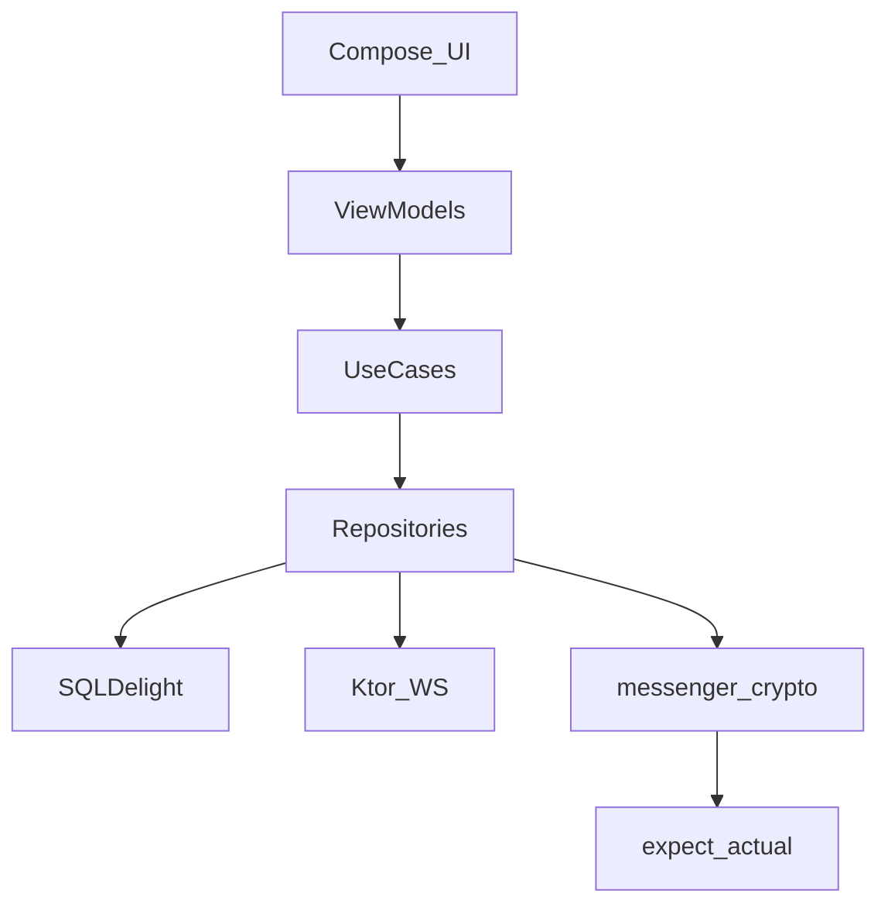

# Клиентская архитектура (KMP)

## 1. Модули Gradle

```
tima-client/
├── shared/
│   ├── domain/          # Use cases, entities
│   ├── data/            # Repositories, API clients
│   ├── crypto/          # messenger-crypto (Kodium wrapper)
│   ├── document/        # DocumentV2, canonical JSON, immutable revisions
│   ├── media/           # validation, 3 variants, E2E/public upload clients
│   ├── sync/            # Outbox, delta sync, conflict rules
│   ├── database/        # SQLDelight schemas
│   └── network/         # Ktor client, WS
├── feature-group/       # Переписка, GK
├── feature-channel/     # Каналы (метаданные)
├── feature-voiceroom/   # Аудио-чаты
├── feature-community/   # Сообщества
├── feature-editor/      # Посты: канал / статья / медиа / история
├── feature-inbox/       # Окно 4: threads, events, preferences
├── feature-reactions/   # Эмоции 1–9, [+]/[−]
├── core-publications/   # posts, drafts
├── core-comments/
├── core-attributes/     # хэштеги, жанры, чипсы
├── core-feeds/          # ленты, полки
├── composeApp/          # Compose Multiplatform UI
├── androidApp/
├── iosApp/
└── desktopApp/          # Windows (JVM/Native)
```

Границы feature-модулей — [module-boundaries.md](./module-boundaries.md); Konsist в CI запрещает cross-feature imports.

## 2. Слои



## 3. Offline-first

1. **Write:** UI → local SQLite (pending) → background sync → server ack → update state.
2. **Read:** SQLite primary; gap fill via sync API.
3. **Crypto:** private DocumentV2 имеет `metadata.content_mode=private`; присутствующие `encrypted_nodes`/`encrypted_metadata` шифруются до enqueue, открытые `markup`/`metadata` входят в signature/AAD; ключи в Secure Enclave / Android Keystore / Windows DPAPI+phone trust.
4. **Revision:** edit создаёт новую immutable revision; pending revision не переписывает уже подтверждённую.

## 4. Platform adapters (`expect`/`actual`)

| Capability | Android | iOS | Windows |
|------------|---------|-----|---------|
| Secure key storage | Keystore | Keychain / Secure Enclave | DPAPI + linked phone key |
| Attestation | Play Integrity | App Attest | QR trust (no attestation) |
| Push | FCM + UnifiedPush fallback | APNs + foreground/resume catch-up | Foreground WS / periodic REST; optional future WNS |
| Camera/Mic | CameraX | AVFoundation | MediaFoundation |
| LiveKit | client-sdk-android | client-sdk-swift | official LiveKit C++ SDK 1.0 через узкий JNI/JNA adapter |
| Biometric lock | BiometricPrompt | LocalAuthentication | Windows Hello |

Все push/WS/app-resume сигналы входят в единый sync coordinator; transport не
является источником сообщения. Полная схема и ограничение iOS без APNs:
[hybrid-notification-delivery.md](./hybrid-notification-delivery.md).

## 4.1. LiveKit на Windows

Звонки обязательны уже в Communication MVP. Windows-клиент использует **официальный LiveKit C++ SDK 1.0**; нативные типы SDK не выходят за узкий JNI/JNA adapter в `CallRepository`. `shared` и UI видят только доменные модели звонка, поэтому обновление SDK не меняет публичную KMP-границу. Основной формат поставки — подписанный **MSIX**; portable-сборка не является release gate.

## 4.2. Attestation и деградация vendor

- iOS отправляет proof только в `POST /v1/verify/attestation/ios`, Android — только в `POST /v1/verify/integrity/android`.
- При недоступности Apple/Google ранее доверенное устройство может получить конфигурируемый grace (не более 30 дней) и продолжить private send.
- Grace не разрешает новую регистрацию или linking устройства. Failed/forged proof никогда не получает grace и блокируется.
- Клиент явно различает `vendor_unavailable`, `proof_failed` и `proof_forged`; общий retry не должен превращать криптографический отказ в vendor outage.

## 4.3. Runtime URLs

| Env | REST base | WebSocket | LiveKit |
|-----|-----------|-----------|---------|
| dev | `https://api.dev.tima.example/v1` | `wss://api.dev.tima.example/v1/ws` | `wss://rtc.dev.tima.example` |
| beta | `https://api.beta.tima.example/v1` | `wss://api.beta.tima.example/v1/ws` | `wss://rtc.beta.tima.example` |
| staging | `https://api.staging.tima.example/v1` | `wss://realtime.staging.tima.example/v1/ws` | `wss://rtc.staging.tima.example` |
| production | `https://api.tima.example/v1` | `wss://realtime.tima.example/v1/ws` | `wss://rtc.tima.example` |

Operational endpoints (`/healthz`, `/readyz`, `/metrics`) не входят в client API и не получают `/v1`.

## 5. Локальная БД (SQLDelight)

| Table group | Содержимое |
|-------------|------------|
| `messages` | immutable DocumentV2 revisions, ciphertext refs, local plaintext cache, sync cursor |
| `chats` | metadata, last message, unread |
| `crypto_sessions` | ratchet state (encrypted blob) |
| `identity` | public keys, device id |
| `search_fts` | decrypted index (private chats only) |
| `media_queue` | `thumbnail/preview/full`, upload chunks, retry state; без Original |
| `sync_outbox` | pending operations + idempotency keys |
| `inbox_local` | кэш inbox_threads/events, read-state |
| `emotions_local` | pending emotion/recommendation sync |
| `attributes_cache` | жанры, подписки на атрибуты |
| `shelf_private` | encrypted private shelf blob + shelf_key wraps |

Схема: [client-sqlite details](../04-data/sync-offline.md).

## 5.1. DocumentV2 и media safety

- Legacy offset/length entities и placeholder не используются.
- `metadata` обязателен (`format_version=2`, `revision_number`, `content_mode`); для групп `content_mode` сверяется с `groups.kind`.
- Текстовый массив, `markup` и `encrypted_metadata` опциональны. Serializer опускает отсутствующее поле и локально хранит `NULL`, не `[]`/`{}`/пустой ciphertext; media-only опускает текстовый массив.
- `has_content` требует непустой текст или реальный media/content binding; пустой layout невалиден.
- Public документы не принимают encrypted-поля и используют `text_link`; private чувствительные ссылки используют `secret_ref`.
- Executable/active content блокируется; `code` рендерится как inert text.
- Private media: sender валидирует source и создаёт три variant до E2E encryption; recipient независимо валидирует MIME/magic bytes, limits, dimensions и decode после decrypt.
- Public media клиент отправляет source только в quarantine pipeline; публикация возможна после server AV/sanitize/transcode.
- Init/complete/read идут через domain endpoints с auth; presigned URL TTL ≤15 минут.

## 6. Навигация

Соответствует [doc_UI/01-app-shell.md](../doc_UI/01-app-shell.md): 5 окон + окно 0 (звонок) + 6–7 блогер.

- **Navigation:** Compose Navigation / Voyager / custom — ADR при выборе библиотеки.
- **State restoration:** save scroll per window in local prefs.

## 7. Зависимости (versions из `Тима.docx`)

| Lib | Version |
|-----|---------|
| Kotlin | 2.0.20+ |
| Compose Multiplatform | 1.10.3+ |
| Kodium | 1.0.0 |
| SQLDelight | latest stable |
| Ktor | 3.x |
| Koin | 4.x |

## 8. Ссылки

- [module-boundaries.md](./module-boundaries.md)
- [feed-ranking.md](../04-data/feed-ranking.md)
- [crypto-protocol.md](../03-security/crypto-protocol.md)
- [multi-device](../04-data/sync-offline.md#4-multi-device)
- [client-hardening.md](../03-security/client-hardening.md)
- [hybrid-notification-delivery.md](./hybrid-notification-delivery.md)
