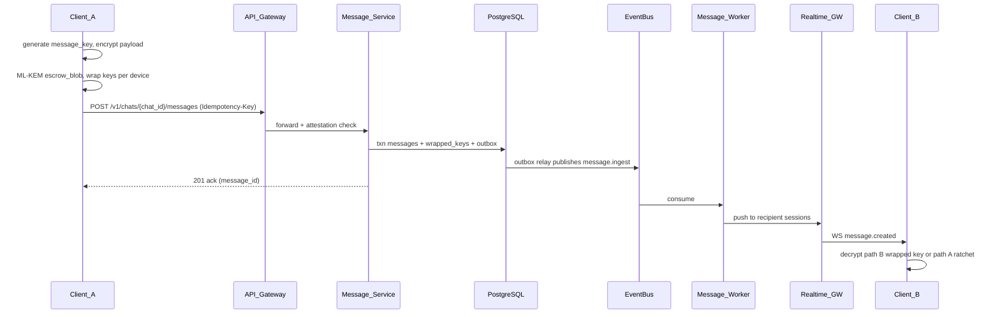
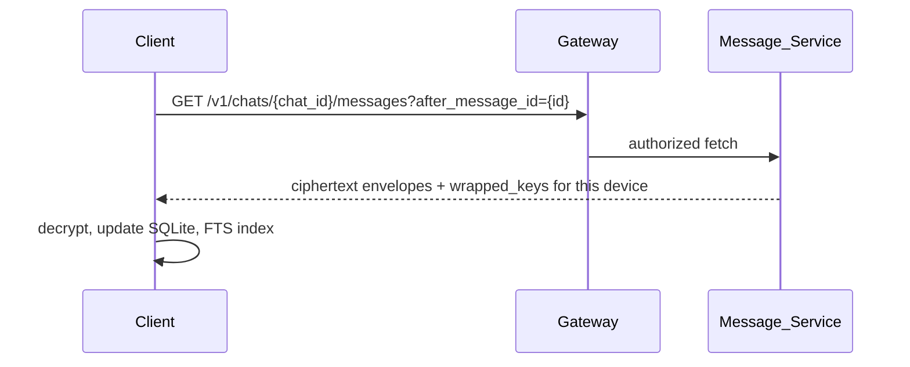
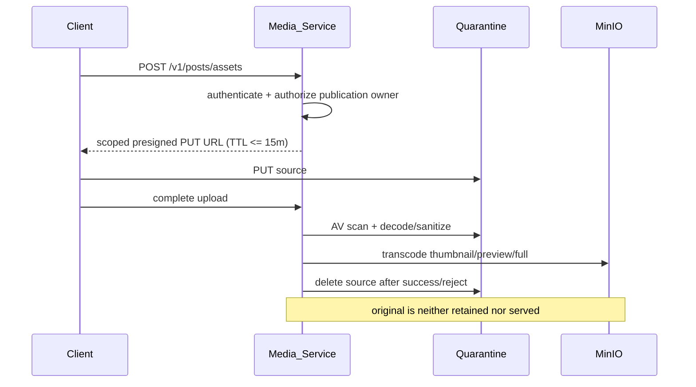
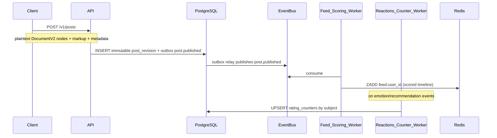
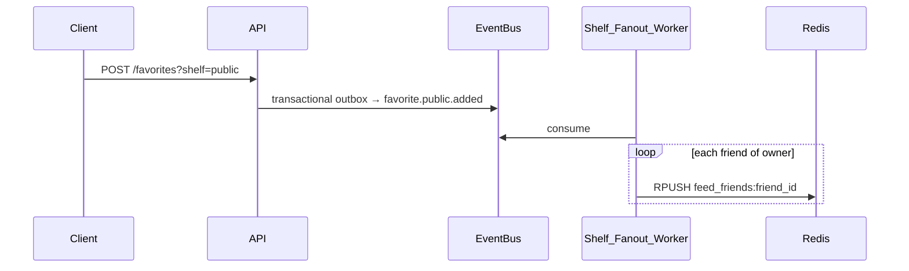
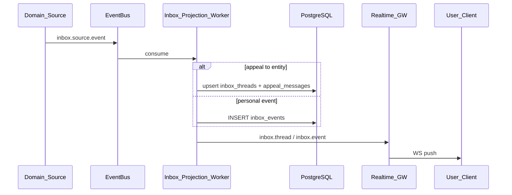
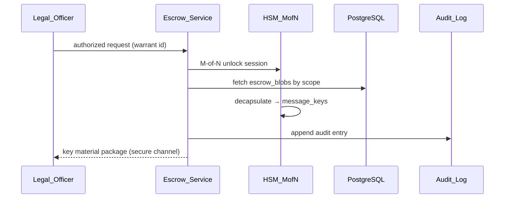
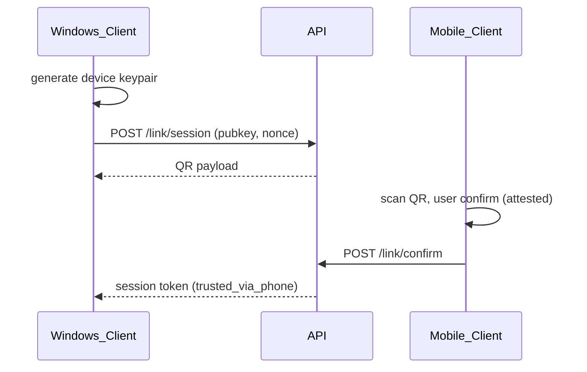
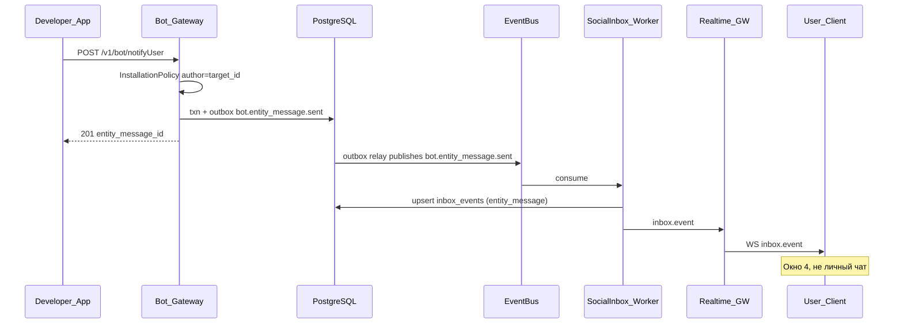
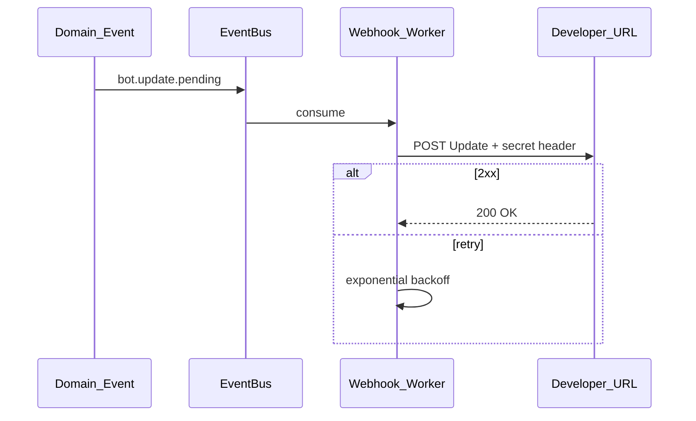

# Потоки данных

> `EventBus` во всех диаграммах означает Redis Streams на beta VPS и Kafka в production/GA. Domain write и outbox row всегда фиксируются одной PostgreSQL transaction; публикацию выполняет outbox relay.

## 1. Отправка личного сообщения (E2E + escrow)



**Path A (ratchet):** быстрый, PFS, может desync.  
**Path B (wrapped key):** надёжный offline delivery — source of truth.

## 2. Sync / history fetch



## 3. Private media upload (participant E2E)

```mermaid
sequenceDiagram
  participant C as Client
  participant Med as Media_Service
  participant S3 as MinIO
  participant MS as Message_Service

  C->>C: validate source; create thumbnail/preview/full
  C->>C: validate + encrypt all three variants
  C->>Med: POST /v1/chats/{chat_id}/media/uploads (or group domain)
  Med->>Med: authenticate + authorize domain owner
  Med-->>C: scoped presigned PUT URLs (TTL <= 15m)
  C->>S3: PUT ciphertext chunks
  C->>Med: complete upload
  C->>MS: POST /v1/chats/{chat_id}/messages (signed DocumentV2 media node)
  Note over C,MS: no original; server cannot AV-scan ciphertext
```

Получатель после decrypt **повторно** проверяет MIME/magic bytes, размер, dimensions, decode и запрет executable/active content. Sender validation не считается достаточной для недоверенного входящего private media.

## 3a. Public media upload



Любой executable/active payload отклоняется. Read URL также требует domain authorization и имеет TTL не более 15 минут.

## 4. Public post fan-out (unified `posts`)



## 4a. Friends feed (public shelf fan-out)



## 4b. Inbox projection (окно 4)



## 5. Звонок 1:1 / группа

```mermaid
sequenceDiagram
  participant A as Caller
  participant CS as Call_Service
  participant LK as LiveKit
  participant B as Callee

  A->>CS: POST /calls invite
  CS->>LK: CreateRoom + tokens
  CS->>B: WS call.incoming + push
  B->>CS: POST /calls/{id}/accept
  CS-->>B: LiveKit token
  A->>LK: WSS connect WebRTC
  B->>LK: WSS connect WebRTC
  Note over A,LK,B: SRTP media via SFU
```

## 6. Escrow legal access (offline)



## 7. Windows device linking



## 8. Ordering guarantees

| Scope | Guarantee |
|-------|-----------|
| Per `chat_id` | Total order of `message_id` |
| Cross-chat | No ordering |
| Public feed | Best-effort per user timeline |
| Calls | Independent of message order |

## 9. Idempotency

- Client generates `Idempotency-Key` (UUID) per send attempt.
- Server dedup window: 24h.
- Retry safe для domain writes: `/v1/chats/{id}/messages`, `/v1/groups/{id}/messages`, domain media uploads и `/v1/posts`.
- Редактирование создаёт новую immutable revision с новым idempotency key; in-place update опубликованного/отправленного DocumentV2 запрещён.

## 10. Bot Platform — `entity_message` в окно 4



MVP без ботов: `POST /inbox/notify` → тот же `SocialInboxProjection` path.

## 11. Bot Platform — webhook update



## 12. Ссылки

- [module-boundaries.md](./module-boundaries.md)
- [feed-ranking.md](../04-data/feed-ranking.md)
- [crypto-protocol.md](../03-security/crypto-protocol.md)
- [sync-offline.md](../04-data/sync-offline.md)
- [call-signaling.md](../06-realtime/call-signaling.md)
- [bot-platform.md](./bot-platform.md)
