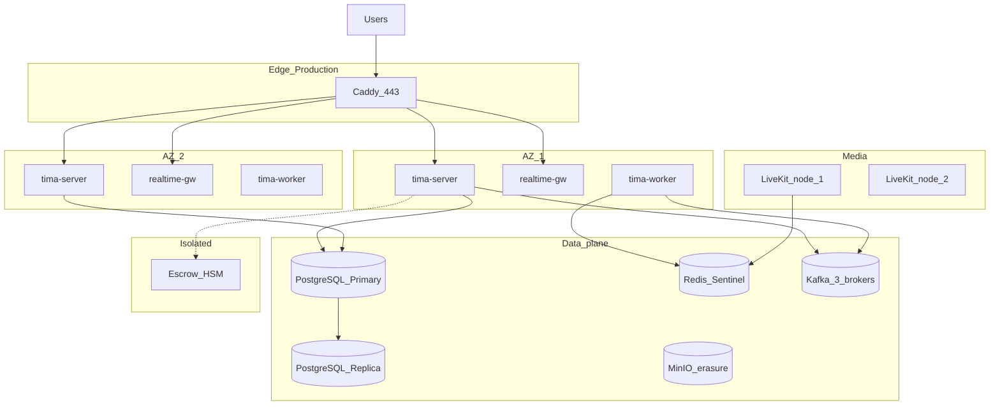

# Deployment topology

## 1. Production/GA — regional cell, multi-AZ



Это production cell: Kafka, multi-AZ и HSM. Beta не использует эту схему: она развёрнута на одном VPS (§1.1), с Redis Streams и escrow stub. В обоих профилях producer атомарно пишет domain state и transactional outbox.

### 1.1. Beta — single VPS

На одном VPS работают отдельные контейнеры `tima-server` (REST), `realtime-gw` (WS) и `tima-worker` (outbox relay/consumers), а также PostgreSQL, Redis Streams, MinIO и LiveKit. Разделение процессов обязательно даже при общей машине: API restart не должен разрывать все WS, а worker масштабируется/перезапускается независимо.

## 2. Kubernetes namespaces

| Namespace | Workloads |
|-----------|-----------|
| `tima-edge` | **Caddy** (MVP) → Envoy/Kong (Growth), cert-manager |
| `tima-app` | `tima-server`, `realtime-gw`, `tima-worker` |
| `tima-data` | Postgres operator, Redis, Kafka (or managed) |
| `tima-media` | LiveKit, TURN, coturn if external |
| `tima-storage` | MinIO |
| `tima-escrow` | escrow-service (NetworkPolicy deny all except app + HSM) |
| `tima-obs` | Prometheus, Grafana, Loki, Tempo |

## 3. Network

| Path | Port / Protocol |
|------|-----------------|
| Public HTTPS/WSS | 443 → **Caddy** → app/realtime |
| Operational HTTP | `/healthz`, `/readyz`, `/metrics` (без `/v1`; `/metrics` только internal/scraped access) |
| Application WS | `WSS /v1/ws` → `realtime-gw` |
| MinIO presigned | 443 → Caddy → MinIO (subdomain); URL ≤15m, minted only after app auth + domain authorization |
| LiveKit signal | 443 WSS → LiveKit |
| WebRTC UDP | 50000–60000 (per node) |
| WebRTC TCP fallback | 7881 |
| Internal mTLS | service mesh optional Phase 2 |

## 4. LiveKit cluster

- Redis required for multi-node (`config-sample.yaml`).
- Co-locate SFU with low-latency to users (same region).
- TURN enabled for restrictive NAT.
- LiveKit всегда использует отдельный DNS `rtc.<env-domain>`.

## 5. Secrets

| Secret | Store |
|--------|-------|
| DB credentials | Vault / K8s sealed secrets |
| LiveKit API keys | Vault |
| JWT signing keys | Vault, rotate 90d |
| Escrow HSM keys | HSM only, never K8s |
| MinIO keys | Vault |

## 6. Growth (1M MAU)

- Postgres: read replicas + connection pooler (PgBouncer).
- Split message tables partition by hash(chat_id).
- Dedicated Kafka topics: `message.ingest`, `post.published`, `emotion.changed`.
- Optional Envoy ingress replacing Caddy.
- LiveKit: 4–8 nodes, autoscale on CPU/bandwidth.

## 7. Pre-GA и target (10M MAU)

- App-level sharding router (see [storage-sharding.md](../04-data/storage-sharding.md)).
- До GA обязательны RU/EU regional cells; каждая изолирует API/realtime/worker, Kafka, Postgres, media plane и regional escrow. RU и EU не являются DR-репликами друг друга; cross-region разрешён только через ciphertext-only relay по [ADR-0018](../adr/0018-dual-region-ru-eu-production-architecture.md).
- Multi-AZ и DR mandatory внутри разрешённой residency boundary каждой production cell. Backup/failover не переносит данные или escrow material между RU и EU.
- CDN for public sanitized `thumbnail/preview/full`; private encrypted variants stay origin-only. `original` отсутствует в permanent storage.

## 8. Environments и публичные URL

| Env | Topology / bus | REST | WebSocket | LiveKit |
|-----|----------------|------|-----------|---------|
| dev | compose; Redis Streams | `https://api.dev.tima.example/v1/*` | `wss://api.dev.tima.example/v1/ws` | `wss://rtc.dev.tima.example` |
| beta | single VPS; Redis Streams | `https://api.beta.tima.example/v1/*` | `wss://api.beta.tima.example/v1/ws` | `wss://rtc.beta.tima.example` |
| staging | production-like; Kafka | `https://api.staging.tima.example/v1/*` | `wss://realtime.staging.tima.example/v1/ws` | `wss://rtc.staging.tima.example` |
| production | dual regional cells, multi-AZ; Kafka | `https://api.tima.example/v1/*` | `wss://realtime.tima.example/v1/ws` | `wss://rtc.tima.example` |

Operational endpoints не версионируются: `/healthz`, `/readyz`, `/metrics`. В beta WS намеренно остаётся на `api.*`; отдельный `realtime.*` обязателен в production (и проверяется на staging). LiveKit использует `rtc.*` во всех средах.

## 9. Local dev (docker-compose sketch)

```yaml
# services: caddy, postgres, redis, minio, livekit, tima-server, realtime-gw, tima-worker
# not committed as production manifest — see ci-cd-release.md
```

## 10. Ссылки

- [tech-stack.md](./tech-stack.md)
- [livekit-operations.md](../06-realtime/livekit-operations.md)
- [disaster-recovery.md](../07-operations/disaster-recovery.md)
- [ADR-0010](../adr/0010-mvp-storage-profile.md)
- [ADR-0011](../adr/0011-mvp-caddy-edge.md)
- [ADR-0008](../adr/0008-multi-region-strategy.md)
