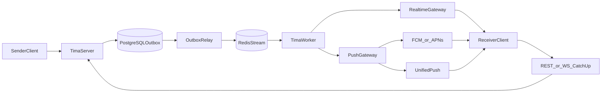

# Гибридная доставка уведомлений

Статус: **целевая архитектура Phase 1, реализация не завершена**  
Решение: приложение поддерживает vendor-канал и независимый канал TIMA; получение
события всегда заканчивается авторитетной синхронизацией через REST/WebSocket.

## 1. Цель

TIMA не должна терять доставку сообщений, если приложение распространяется вне
Google Play или удалено из магазина. Для этого используются два канала:

1. **Vendor push:** FCM на Android и APNs на iOS. Он обеспечивает наиболее
   надёжное пробуждение фонового приложения, но требует vendor credentials.
2. **TIMA fallback:** собственный Go `push-gateway`, UnifiedPush на Android и
   WebSocket/REST catch-up на всех платформах. Этот путь не требует учётных
   данных Google Play Console или Apple Developer для публикации приложения.

Push не является источником сообщений. Он передаёт только безопасный wake-up
сигнал, после которого клиент получает ciphertext и ключевые обёртки через
обычный API и расшифровывает их локально.

## 2. Ограничение iOS

Apple не предоставляет стороннему приложению способ надёжно разбудить процесс
из `suspended` или `terminated` без APNs entitlement. Собственный сервер,
UnifiedPush, WebSocket, background fetch и локальный таймер это ограничение не
обходят.

Поэтому iOS имеет два режима, но не два равноценных background push transport:

- с APNs — background wake-up и последующий catch-up;
- без APNs — WebSocket, пока приложение активно, и обязательный REST catch-up
  при открытии или возвращении в foreground.

Документация, UI и SLO не должны называть второй режим полноценным фоновым push
на iOS.

## 3. Каналы по платформам

| Платформа | Основной канал | Независимый fallback | Поведение без store credentials |
|---|---|---|---|
| Android | FCM | UnifiedPush через `push-gateway`; foreground WS | Работают UnifiedPush, WS и REST catch-up |
| iOS | APNs | Foreground WS и REST catch-up при активации | Нет background wake-up; сообщения загружаются при открытии |
| Windows | Foreground WebSocket | Периодический REST catch-up | Полный credential-free режим без WNS и Microsoft Store |

Android-сборка может содержать оба provider adapter. Наличие FCM определяется
build/runtime-конфигурацией; отсутствие FCM не должно блокировать регистрацию
UnifiedPush.

## 4. Поток доставки



1. Сообщение и outbox event фиксируются одной транзакцией.
2. Worker публикует realtime event независимо от push.
3. Если устройство offline, worker выбирает зарегистрированные transport по
   приоритету и отправляет generic payload в `push-gateway`.
4. `push-gateway` выбирает FCM, APNs или UnifiedPush adapter. Vendor adapters
   отключены, если credentials не настроены.
5. Получив wake-up, клиент запускает единый sync coordinator.
6. Coordinator восстанавливает разрыв через REST, обновляет локальную БД и
   переподключает WebSocket. UI читает только локальную БД.

Ошибка push не откатывает сообщение и не блокирует обработку Redis Stream.
Авторитетный catch-up должен восстановить пропущенные события.

## 5. Компоненты

### 5.1. `push-gateway`

Новый Go-сервис находится в текущем monorepo и разворачивается вместе с
Phase 1 stack. Его обязанности:

- authenticated endpoint для `tima-worker`;
- adapters `fcm`, `apns`, `unifiedpush`;
- generic payload validation без private plaintext;
- timeout, retry с ограничением и классификация permanent/transient errors;
- invalid-token response для удаления устаревшей регистрации;
- метрики по provider, результату и latency без записи токенов в логи.

Gateway не хранит сообщения и не расшифровывает контент. FCM/APNs credentials
опциональны; UnifiedPush path обязан запускаться без них.

### 5.2. Регистрации устройств

Одна учётная запись устройства может иметь несколько transport registrations:

```text
(device_id, provider, encrypted_token_or_endpoint, priority, updated_at)
```

Правила:

- Android: `fcm` и/или `unifiedpush`;
- iOS: только `apns`;
- Windows: optional WNS registration только в будущем credentialed profile;
  credential-free режим не регистрирует push endpoint;
- token/endpoint шифруется at rest и не попадает в логи;
- повторная регистрация идемпотентна;
- revoke устройства отключает все его transport;
- пользователь может отключить vendor или fallback отдельно.

Android по умолчанию предпочитает FCM, если он доступен, затем UnifiedPush.
Дублирование подавляется общим `collapse_key` и идентификатором события.

### 5.3. Клиентский sync coordinator

FCM, APNs, UnifiedPush, foreground WS и app-resume вызывают один и тот же
координатор. Он:

1. валидирует generic payload;
2. не доверяет payload как состоянию сообщения;
3. coalesces повторные wake-up одного чата;
4. выполняет delta sync с сохранённого cursor;
5. сохраняет ciphertext и расшифрованную локальную проекцию;
6. обновляет notification UI согласно локальным privacy settings;
7. восстанавливает WebSocket subscription.

## 6. Payload и приватность

Для private message разрешён только generic payload:

```json
{
  "type": "message",
  "chat_id": "uuid",
  "preview": "Новое сообщение",
  "encrypted": true,
  "collapse_key": "chat:{uuid}"
}
```

Запрещены sender name, текст, media caption, plaintext metadata, ciphertext
сообщения и ключи. Одинаковая политика применяется ко всем transport.
Self-hosted канал не ослабляет E2E, escrow или local-decrypt rules.

## 7. Деградация и переключение

| Ситуация | Поведение |
|---|---|
| FCM недоступен, UnifiedPush зарегистрирован | Gateway использует UnifiedPush |
| Vendor credentials отсутствуют | Vendor adapter выключен; stack остаётся healthy |
| UnifiedPush distributor недоступен | Push soft-fail; клиент восстановится через WS/REST |
| Все push transport недоступны | Foreground WS и app-resume catch-up |
| Повторная доставка двумя каналами | Dedup по event/message ID и sync cursor |
| Истёкший/отозванный token | Permanent error удаляет соответствующую registration |
| Устройство revoked | Ни один transport не получает новые события |

Переключение не создаёт отдельную очередь сообщений: durable source остаётся
PostgreSQL + transactional outbox.

## 8. Работа без аккаунтов магазинов

На credential-free этапе доступны:

- Android direct distribution с UnifiedPush;
- Windows package с WS/REST catch-up;
- iOS simulator/foreground режим без background wake-up;
- локальный и hosted E2E собственного gateway;
- unsigned platform validation.

Отложены до Phase 5:

- Apple Developer и Google Play publication setup;
- signed internal candidates и store tracks;
- реальные APNs/FCM/App Attest/Play Integrity;
- device matrix и invited-cohort SLO evidence до 100 пользователей.

Отсутствие store credentials не разрешает development HMAC, тестовые ключи или
placeholder endpoints в production profile.

## 9. Наблюдаемость и SLO

Минимальные метрики:

- attempts/success/transient_failure/permanent_failure по provider;
- gateway latency;
- invalid registrations removed;
- wake-to-sync и sync completion latency;
- сообщения, восстановленные только catch-up;
- число активных registrations по provider без token labels.

До cohort stage локальный smoke подтверждает корректность, но не является
статистическим доказательством delivery SLO.

## 10. Phase 1 acceptance

- `push-gateway` работает в Compose без FCM/APNs credentials.
- Android регистрирует FCM и UnifiedPush независимо и принимает fallback wake-up.
- Push failure не блокирует outbox/stream processing.
- После любого wake-up клиент получает сообщение через общий sync coordinator.
- Windows восстанавливает сообщения через WS/REST без WNS.
- iOS без APNs явно показывает ограниченный режим и выполняет catch-up при
  foreground/resume.
- Все transport используют одинаковую generic-payload policy.
- Unit, integration и black-box tests подтверждают routing, fallback, dedup,
  revoke и отсутствие private plaintext.

Phase 2 не требуется и не начинается для реализации этой схемы.

## 11. Ссылки

- [Push Payloads](../05-api/push-payloads.md)
- [Sync и Offline](../04-data/sync-offline.md)
- [Клиентская архитектура](./client-architecture.md)
- [Phase 1 release gates](../07-operations/release-gates.md)
- [Phase 1 exit review](../09-delivery/phase1-exit-review.md)
