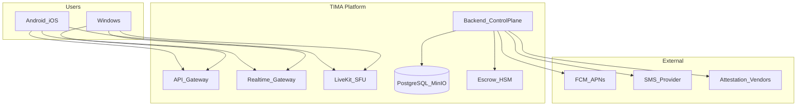
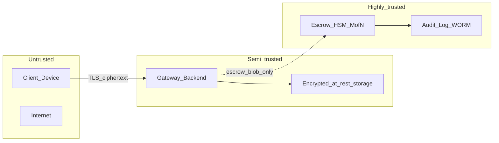

# Системная архитектура

## 1. Context (C4 Level 1)

## 2. Container (C4 Level 2)

| Container | Технология | Ответственность |
|-----------|------------|-----------------|
| **Client (KMP)** | Compose Multiplatform | UI, crypto, local DB, sync |
| **Edge (MVP)** | Caddy 2 | TLS termination, REST/WS routing ([ADR-0011](../adr/0011-mvp-caddy-edge.md)) |
| **API Gateway (Growth)** | Envoy / Kong | WAF, mTLS, advanced routing |
| **Control Plane** | Go modular monolith → services | Auth, users, chats, keys, groups, calls metadata |
| **Realtime Gateway** | Go + WebSocket | Persistent connections, push fan-in |
| **Message Pipeline** | Go workers + transactional outbox | Durable ingest, fan-out, ordering per chat |
| **Feed / Reactions Workers** | Go workers + event bus/Redis | Feed scoring, shelf fan-out, rating_counters |
| **Media Service** | Go | Private ciphertext relay; public quarantine + AV/sanitize/transcode; presigned URL ≤15m |
| **LiveKit Cluster** | Go SFU | WebRTC rooms, TURN |
| **Escrow Service** | Go + HSM/Nitro | Decapsulate blobs, audit (no routine plaintext) |
| **PostgreSQL** | 16+ | DocumentV2 revisions, metadata, wrapped keys, public plaintext content |
| **Redis** | Cluster | Sessions, presence, rate limits, **not** message SoT |
| **Event bus** | Redis Streams (beta) → Kafka (production/GA) | Events, fan-out, audit stream; PostgreSQL transactional outbox is mandatory in both profiles |
| **MinIO/S3** | S3 API | Private encrypted and public sanitized `thumbnail/preview/full`; no Original |
| **OpenSearch** | 8.x | Public content search only |
| **ClickHouse** | — | Aggregated analytics (no message bodies) |

## 3. Trust boundaries

- **Backend** видит private ciphertext, открытые `markup`/`metadata` JSONB и wrapped keys (не может расшифровать без identity private key). Канонизированные открытые JSONB входят в signature и AEAD AAD.
- **Escrow** расшифровывает только по M-of-N; не в hot path сообщений.

## 4. Эволюционная декомпозиция

См. [ADR-0001](../adr/0001-evolutionary-services.md).

**Beta / Communication MVP:** один VPS, но три отдельных процесса/контейнера из одного Go release: `tima-server` (REST), `realtime-gw` (WS) и `tima-worker` (outbox consumers), плюс LiveKit и MinIO. Event bus — Redis Streams; PostgreSQL commit + transactional outbox является точкой durable ack.

**Production/GA:** Kafka заменяет Redis Streams как event bus; outbox relay переключается без изменения доменных producer contracts. Выделяются `media-service`, `key-service`, `notification-service`.

**Pre-GA:** две региональные cells с изолированными compute/data plane и явно назначенным home region; beta остаётся single-VPS.

**Phase 10M:** sharded Postgres, dedicated Kafka clusters, multi-AZ LiveKit mesh.

Имена runtime-процессов и образов каноничны во всех средах: `tima-server`, `realtime-gw`, `tima-worker`.

## 5. Два домена данных

| Дomain | Модель | Примеры |
|--------|--------|---------|
| **Private messaging** | DocumentV2: required `metadata.content_mode=private`; optional `encrypted_nodes`, open `markup`, `encrypted_metadata`; E2E + wraps + escrow | 1:1, private groups, private media |
| **Public social** | DocumentV2: required `metadata.content_mode=public`; optional plaintext `nodes`/`markup`, no encrypted fields; fan-out + search | Channels, public groups, feeds |

`DocumentV2` полностью заменяет offset/length entities и placeholder ([ADR-0015](../adr/0015-document-v2-and-media-pipeline.md)). Metadata всегда содержит `format_version=2`, `revision_number`, `content_mode`; для групп режим совпадает с `groups.kind`. Отсутствующие payload-поля передаются omitted/`NULL`, без `[]`/`{}`/пустого ciphertext; media-only опускает текстовый массив. `has_content` требует непустой текст или реальный media/content binding, пустого layout недостаточно. Public использует `text_link` с открытым `href`; private sensitive link — entity `text_link` с `secret_ref` на URL в `encrypted_metadata`. Все опубликованные/отправленные revisions immutable; edit создаёт новую revision, а active legal hold приостанавливает physical purge.

Private media проходит sender validation до E2E encryption и независимую recipient validation после decrypt. Public media проходит server AV, sanitize и transcode. Оба pipeline выдают ровно `thumbnail`, `preview`, `full`, без `original`; executable content блокируется.

**Социальный контейнер (Community):** admin-aggregate — [social-objects/00-index.md](../01-product/social-objects/00-index.md).

### 5.1. Ownership модулей

Полные границы сущностей и полиморфных подсистем — [module-boundaries.md](./module-boundaries.md).

| Модуль | Владеет | Не владеет |
|--------|---------|------------|
| Community | контейнер, подписка, attach | посты, комментарии, GK |
| Group | переписка, GK | Comments subsystem |
| Channel | метаданные канала | контент (→ `publications`) |
| VoiceRoom | room, LiveKit ACL | текстовый контент |
| **Publications** | `posts`, `post_drafts`, schedule | комментарии |
| **Comments** (shared) | комментарии `post\|media\|collection_item` | контент родителя |
| **Reactions** (shared) | `emotions` (1–9), `recommendations`, `rating_counters` | — |
| **Attributes** (shared) | `attributes`, `genres`, `post_attributes`, `user_attributes` | посты |
| **Feeds** (shared) | fan-out, `feed:{user_id}` materialization | исходные посты |
| **SocialInbox** | `inbox_threads` FSM, `appeal_messages`, `entity_messages` + revisions, `inbox_events`, preferences | копия E2E-сообщений |
| **VirtualUserAccess** | ВП CRUD, operators, key wraps, transfer, audit | managed message tables |
| **BotPlatform** | apps, installations, tokens, webhooks, updates | user auth, E2E, VP operators |

Разделение на уровне API, топиков Kafka и индексов поиска — см. [ADR-0007](../adr/0007-search-split.md).

### 5.2. Воркеры (async plane)

| Worker | Триггер | Выход |
|--------|---------|-------|
| `tima-worker` / message consumer | event `message.ingest` | WS push, push notifications |
| `feed-scoring-worker` | `post.published`, emotion/recommendation events | Redis `feed:{user_id}` (общая лента) |
| `shelf-fanout-worker` | `favorite.public.added` | Redis `feed_friends:{user_id}` |
| `reactions-counter-worker` | INSERT/UPDATE/DELETE `emotions` | `rating_counters` по `subject_type/subject_id` |
| `search-index-worker` | outbox public content | PG FTS / OpenSearch (Growth) |
| `inbox-projection-worker` | domain events (comments, reactions, appeals) | `inbox_events`, WS `inbox.*` |

Хранилище beta: PG + Redis + MinIO. Transactional outbox обязателен: beta relay публикует в Redis Streams, production/GA — в Kafka; смена транспорта не меняет атомарность domain write + outbox row.

## 5.3. Runtime security invariants

- Канонические verification routes: `POST /v1/verify/attestation/ios` и `POST /v1/verify/integrity/android`.
- При outage attestation vendor только ранее доверенное устройство может получить конфигурируемый grace ≤30 дней с private send. Новая регистрация/linking блокируются; failed/forged proof блокируется без grace.
- Beta допускает изолированный escrow stub, но `escrow_strict=true` и fail-closed private send обязательны уже там. `false` разрешён только в local dev/test без пользовательских данных. HSM обязателен до production в Phase 4; в production strict mode не может быть обойдён feature flag, конфигурацией или аварийным runbook.

## 6. Зависимости vendor

| Vendor | Роль | Integration point |
|--------|------|-------------------|
| Kodium | Client crypto primitives | `shared/crypto` KMP module |
| LiveKit | Media SFU | Token service in control plane |

## 7. Ключевые потоки (сводка)

**Ленты** ([feed-ranking.md](../04-data/feed-ranking.md)): публикация поста → `post_attributes` → feed-scoring-worker → Redis; публичная полка друга → shelf-fanout-worker → `feed_friends:{user_id}`.

**Реакции:** эмоция 1–8 → reactions-counter-worker инкрементирует `rating_counters` у автора контента и у `group`/`channel` (subject); эмоция 9 нейтральна.

**Inbox (окно 4):** обращения к ВП — E2E в `chats` + `inbox_threads` metadata; обращения к сущностям — `appeal_messages` (plaintext); события агрегатора — `inbox_events` с личным read-state. FSM: `new → taken → snoozed → closed`.

## 8. Связанные документы

- [module-boundaries.md](./module-boundaries.md)
- [tech-stack.md](./tech-stack.md)
- [social-objects/00-index.md](../01-product/social-objects/00-index.md)
- [public-content-format.md](../01-product/public-content-format.md)
- [feed-ranking.md](../04-data/feed-ranking.md)
- [client-architecture.md](./client-architecture.md)
- [backend-services.md](./backend-services.md)
- [data-flows.md](./data-flows.md)
- [deployment-topology.md](./deployment-topology.md)
- [bot-platform.md](./bot-platform.md)
