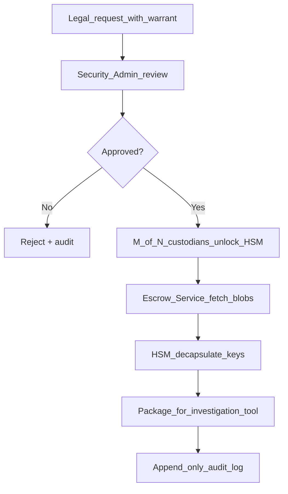

# Escrow и юридический доступ

> **Decision:** [ADR-0004](../adr/0004-controlled-escrow.md) (amended by [ADR-0016](../adr/0016-escrow-key-hierarchy-and-threshold.md)), [ADR-0014](../adr/0014-participant-e2e-and-recovery.md) — controlled escrow **обязателен** для всего private контента.  
> Терминология: [glossary.md](../01-product/glossary.md) · UI: [27-security-privacy.md](../doc_UI/27-security-privacy.md)

## 1. Модель

Private сообщения, GK periods и `shelf_key` versions **MUST** содержать `escrow_blob`, зашифрованный под **региональный иерархический** ключ `Escrow_Public[region,epoch,shard]` (см. §1a, [ADR-0016](../adr/0016-escrow-key-hierarchy-and-threshold.md)), а не под единый глобальный ключ.

- Сервер **не может** расшифровать в normal operation.
- RU/EU cells имеют независимые escrow hierarchies, HSM, custodians и signing roots; ключ выбирается только по immutable `conversation.home_region`.
- HSM/enclave decapsulate **только** после M-of-N authorization и **только** через threshold (полный приватный ключ не собирается, §3a).
- Выход операции — **message-ключи по scope ордера**, а не приватный ключ (scope-инвариант, §3b).
- **Полный доступ** в scope запроса: все сообщения, **включая `deleted=true`**, до physical purge.
- Participant E2E — основной контур для пользователей; escrow — **параллельный compliance-слой**.
- Продукт **не** strict E2E в юридическом смысле; пользователь информирован в политике.

Реализация escrow (HSM vendor, M-of-N параметры, алгоритм) **может корректироваться** без изменения participant path.

## 1a. Иерархия ключей (epoch × shard) — mitigation R-0

Единый долгоживущий `Escrow_Private` — точка компрометации всего контента (риск **R-0** из [kodium-security-audit.md](./kodium-security-audit.md)). Каноника — семейство ключей:

```text
Escrow_Public[region, epoch, shard]
  region = immutable conversation.home_region (RU | EU)
  epoch = календарный квартал (YYYYQn), настраиваемо
  shard = chat_shard (hash-партиция chat_id, см. ../04-data/storage-sharding.md)
```

- `escrow_blob` начинается с открытых `region_id || epoch_id || shard_id || key_id || key_commitment`; клиент выбирает публичный ключ по home region беседы, дате и шарду. Отсутствующий commitment делает blob невалидным.
- **Ротация:** новый ключ на каждую эпоху; current+next public keys публикуются заранее в подписанном config bundle (§1b).
- **Уничтожение:** `Escrow_Private[region,epoch,shard]` физически стирается в regional HSM после 6-месячного retention соответствующего private content или снятия legal hold — «harvest now, decrypt later» невозможен за окном.
- Радиус компрометации одного приватного ключа = одна regional cell × один квартал × один шард, не вся история.

Формат blob и гибридная (X25519-threshold + ML-KEM) конструкция — см. [ADR-0016](../adr/0016-escrow-key-hierarchy-and-threshold.md) §2.

## 1b. Signed escrow config bundle

Authenticated `GET /v1/escrow/config` возвращает canonical bundle:

```text
EscrowConfigBundle {
  config_version, region, epoch_id, shard_id, key_id
  valid_from, valid_until
  current_public_keys { x25519_threshold, mlkem768 }
  next_public_keys?   { x25519_threshold, mlkem768 }
  signature
}
```

- Signature покрывает все поля и проверяется до использования через цепочку к pinned **regional signing root** клиента.
- Клиент отклоняет unsigned, expired/not-yet-valid, unknown `key_id`, wrong epoch/shard и cross-region bundle.
- Private keys никогда не входят в bundle, не возвращаются API и не покидают HSM.
- Beta stub реализует тот же wire/error contract и подписывает отдельным pinned test root; «временно без подписи» запрещено.

## 1.1. Терминология для пользователей

Юридически схема **не является strict E2E**: существует технический канал доступа по процедуре.

| Где | Формулировка |
|-----|--------------|
| UI (статус чата) | «Защищённый чат — сообщения шифруются на вашем устройстве» |
| UI (окно информации, [16-profile-popup](../doc_UI/16-profile-popup.md)) | Краткое пояснение + ссылка на политику |
| Политика конфиденциальности | Полное описание: шифрование на клиенте; доступ провайдера возможен только по юридически обязывающему запросу через многостороннюю процедуру с аудитом |
| Маркетинг | Не использовать «E2E»/«сквозное» без оговорки |

Внутри документации термин «E2E» допустим только как UI-ярлык со ссылкой на [glossary.md](../01-product/glossary.md).

## 2. Workflow



## 3. M-of-N policy (default)

| Parameter | Value |
|-----------|-------|
| Total custodians | 5 |
| Required (M) | 3 |
| Session TTL | 4 hours |
| Max messages per request | 10 000 (configurable) |
| Cooldown between bulk | 24h |

## 3a. Threshold decapsulation — приватный ключ не собирается целиком

M-of-N **не** реконструирует полный `Escrow_Private` в памяти HSM. Вместо Shamir-сборки применяется threshold-decapsulation ([ADR-0016](../adr/0016-escrow-key-hierarchy-and-threshold.md) §2):

- Приватный X25519-скаляр разделён t-of-n; каждый кастодиан вычисляет **частичный** результат DH (`share_i * eph.public`), результаты комбинируются по Лагранжу — полный скаляр не существует ни в одной точке.
- ML-KEM-слой обеспечивает PQ-конфиденциальность (decapsulate внутри enclave); оба слоя обязательны (`HKDF(ss_cl || ss_pq)`).
- Утечка памяти enclave в момент операции не даёт полного приватного ключа.
- **Known limitation:** нативный PQ-threshold — research-grade; интерим — `MLKEM_priv` внутри enclave под той же авторизацией, per-epoch уничтожение; threshold-гарантия обеспечивается classical-слоем. PQ-threshold — в roadmap.

## 3b. Scope-инвариант HSM

HSM/enclave **никогда не экспортирует приватный материал**. Вход — подписанный ордер, выход — только message-ключи в пределах scope:

```text
DecapRequest {
  warrant_ref, scope{ chat_ids[], date_from, date_to }, custodian_approvals[M]
}
→ enclave: для каждого escrow_blob в scope → threshold-decap → message_key
         → key_commitment check (см. §3c) → выход: список message_key ⊆ scope
Escrow_Private НЕ покидает HSM ни в каком виде.
```

Инвариант: **один доступ = ровно ордер, не больше**. Расширение доступа возможно только новым ордером, что фиксируется в transparency log (§4a).

## 3c. Key-commitment invariant (связь с R-1)

Escrow-путь **обязан** приводить к тому же `message_key`, что и wrapped/ratchet-путь ([ADR-0017](../adr/0017-kodium-crypto-hardening.md)). Enclave пересчитывает `key_commitment = HKDF-SHA256(message_key, info="tima/commit/v1")` и сверяет с подписанным заголовком envelope. Несовпадение → ключ помечается `commitment_mismatch` в investigation package и audit. Без этой проверки следствие может получить контент, отличный от увиденного получателем (R-1).

## 4. Audit log (WORM)

Каждая запись:

```json
{
  "request_id": "uuid",
  "warrant_ref": "string",
  "requester_org": "string",
  "scope": {"chat_ids": [], "date_from": "", "date_to": ""},
  "messages_requested": 150,
  "messages_decrypted": 138,
  "user_deleted_count": 12,
  "custodians": ["id1","id2","id3"],
  "timestamp": "ISO8601",
  "operator_id": "string"
}
```

Retention audit: **7 years** minimum. Все security/compliance события (legal hold/release, purge, config/key rotation, recovery limit override, decapsulation) записываются в generic append-only WORM log. Каждая запись содержит `prev_hash` (hash-chain); batch/epoch checkpoint включается в Merkle tree и подписывается. Изменение, удаление или перестановка записей обнаруживаются проверкой chain + Merkle root.

## 4a. Verifiable transparency log

Внутренний generic WORM-audit (§4) дополняется **публично-проверяемым** append-only логом фактов декапсуляции:

- Каждая decap-операция → запись с криптографическим доказательством включения (Merkle-tree, в духе Certificate Transparency).
- Публикуется корень дерева; внешний наблюдатель может проверить, что доступ не был скрыт задним числом.
- Скрыть массовый доступ невозможно даже для инсайдера с правами на HSM.
- Агрегаты (scope-размеры, число ордеров) идут в transparency report ([privacy-compliance.md](./privacy-compliance.md) §6).

## 5. Soft delete semantics

| Flag | Client view | Escrow / legal view | Physical purge |
|------|-------------|---------------------|----------------|
| `deleted=false` | Visible | Available | Per retention |
| `deleted=true` | Hidden | **Fully available** | Per retention only |

User «delete for all» создаёт tombstone и скрывает контент у участников; исходная immutable revision и escrow archive сохраняют ciphertext + blob до истечения retention или снятия legal hold. Audit: «N of M messages were user-deleted».

**Physical purge** — единственное безвозвратное удаление для escrow ([retention-archival.md](../04-data/retention-archival.md)).

## 6. Retention matrix

| Data class | Retention |
|------------|-----------|
| Transmission metadata | 3 years |
| Content, ciphertext, media variants, immutable revisions | 6 months |
| `escrow_blob` and participant wrapped keys | 6 months |
| Escrow/legal-hold/WORM audit events and proofs | 7 years |

По истечении 6 месяцев content object graph (revisions, ciphertext, media, `escrow_blob`, participant wraps) физически purge-ится атомарно, если нет active legal hold. Escrow не используется как user recovery.

**Уничтожение escrow-ключей:** после истечения 6-месячного content retention всех blob эпохи/шарда (и при отсутствии active legal hold) `Escrow_Private[region,epoch,shard]` физически стирается в HSM. После этого соответствующий `escrow_blob` **не расшифровывается никем**.

### 6.1. Legal hold

- Generic legal hold задаётся юридически утверждённым selector/scope (subject, account, conversation, message/revision, media object, time range или их комбинация) и приостанавливает physical purge полного связанного object graph, включая wraps и `escrow_blob`.
- Soft delete и истечение обычного retention не обходят active hold.
- Hold/release/purge — отдельные WORM audit events с actor, authority, scope и timestamp.
- Снятие hold возвращает объект к retention schedule; purge выполняется отдельной контролируемой операцией.

## 7. Media escrow

Escrow keyed by `period_id` / GK — **not per file**. One lookup decrypts text + media for period. В scope входят только три immutable variant: `thumbnail`, `preview`, `full`; `original` не хранится. Legal hold блокирует purge variants вместе с revision, которая на них ссылается.

## 8. Fail-closed

If Escrow Service or HSM unavailable during **send** of private message:

- **Option A (chosen):** reject send with user-visible error «Сервис защиты временно недоступен».
- Ensures every private message has valid escrow_blob.
- Production feature flag, privileged endpoint, operator override или fallback, позволяющий private send без валидного signed config, `key_commitment` и `escrow_blob`, **запрещён**.

Public content unaffected.

## 9. Transparency

- Publish annual transparency report template: [privacy-compliance.md](./privacy-compliance.md).
- In-app: Settings → Privacy → «Политика доступа по закону».

## 10. Investigation package

Delivered via secure channel (encrypted ZIP, separate key ceremony):

- Decrypted **message keys** in scope (never raw `Escrow_Private` — scope-инвариант §3b)
- Ciphertext payloads from storage
- Metadata (timestamps, sender ids)
- `key_commitment` verification status per message (`ok` / `commitment_mismatch`, §3c)
- Chain-of-custody document + transparency log inclusion proof (§4a)

## 11. Ссылки

- [ADR-0016](../adr/0016-escrow-key-hierarchy-and-threshold.md) — key hierarchy + threshold + scope invariant
- [ADR-0017](../adr/0017-kodium-crypto-hardening.md) — key commitment (R-1)
- [kodium-security-audit.md](./kodium-security-audit.md) — R-0, R-1
- [crypto-protocol.md](./crypto-protocol.md)
- [glossary.md](../01-product/glossary.md)
- [threat-model.md](./threat-model.md)
- [privacy-compliance.md](./privacy-compliance.md)
- [doc_UI/27-security-privacy.md](../doc_UI/27-security-privacy.md)
- [retention-archival.md](../04-data/retention-archival.md)
- [storage-sharding.md](../04-data/storage-sharding.md)
