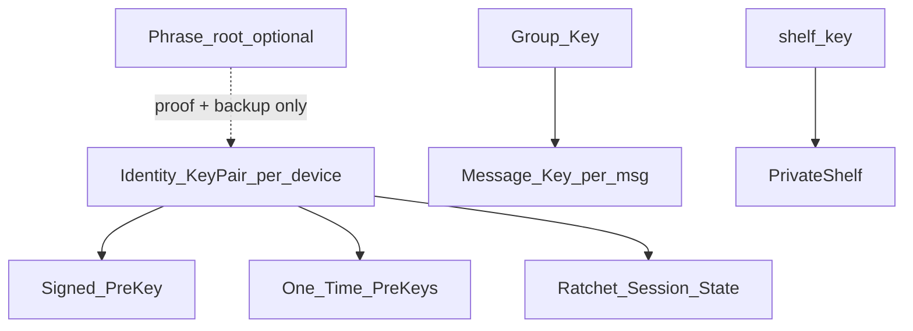

# Key Lifecycle

> **Decision:** [ADR-0014](../adr/0014-participant-e2e-and-recovery.md)

## 1. Key hierarchy



## 2. Identity keys

| Event | Action |
|-------|--------|
| Registration | Generate identity keypair per device; upload public to Key Service |
| Export | `exportToEncryptedString(password)` — local backup |
| Rotation | Manual only v1; new identity = new user-facing fingerprint |
| Compromise | Revoke all devices, rotate identity; history recoverable via peers or phrase backup if enabled |

**Storage:** Secure Enclave / Android Keystore / encrypted file on Windows (linked device).

## 3. PreKey bundle (X3DH)

Published to server:

```text
PublicBundle {
  identityKey
  signedPreKey
  signedPreKeySignature  // Ed25519(identity.signing, SPK) — REQUIRED before external ratchet testing
  oneTimePreKey?         // consumed on use
}
```

| Maintenance | Policy |
|-------------|--------|
| OTK count | Replenish when < 20 |
| SPK rotation | Every 7 days |
| **Signed prekey verify** | **Blocking before any external ratchet tester** ([ADR-0005](../adr/0005-kodium-readiness-gate.md)) |

## 4. Device keys (multi-device)

Each device has **separate** sub-device identity key (signed by account master in messenger-crypto).

| Scenario | Behavior |
|----------|----------|
| New device approved | Trusted device signs approval; peer recovery or wrapped-key backfill within retained 6-month window |
| Ratchet on phone A | Phone B: ratchet session or wrapped-key fallback |
| Device revoked | Stop wraps; invalidate refresh; notify peers |

## 5. Ratchet session (participant E2E)

| State | Storage |
|-------|---------|
| Active session | SQLDelight encrypted blob |
| Export | `session.exportToEncryptedString(storageKey)` to trusted device |
| Loss | Wrapped-key fallback; peer recovery; re-X3DH background |
| MAX_SKIP | 2000 (Kodium default) |

External ratchet testing запрещено до проверки `signedPreKeySignature`. После прохождения audit/vectors ratchet становится required-by-default для 1:1 **до GA**; wrapped keys остаются fallback, но не заменяют ratchet default.

## 6. Group keys (GK)

| Event | Action |
|-------|--------|
| Create group | Generate GK v1, wrap for all members, escrow blob |
| Periodic | New GK every 100 messages |
| Member join | Immediate rotation |
| Member leave / kick | Immediate rotation; old wraps retained with protected content for 6 months, then purged unless legal hold is active |

## 6a. Private shelf key (`shelf_key`)

| Event | Action |
|-------|--------|
| Create private shelf | Client generates `shelf_key` v1; encrypt; upload blob + wraps + escrow |
| Grant access | Owner approves → wrap on grantee `device_id` |
| Revoke access | Rotate `shelf_key`; re-encrypt; re-wrap remaining grantees |
| Recovery | **Phrase backup or old device only** — no peer path |

## 7. Escrow keys ([ADR-0016](../adr/0016-escrow-key-hierarchy-and-threshold.md))

Единый глобальный escrow-ключ заменён региональными иерархиями `Escrow_Public[region, epoch, shard]` (mitigation R-0). RU и EU — отдельные regional cells с независимыми HSM, custodians и signing roots; `conversation.home_region` неизменяемо выбирает иерархию:

| Key | Location | Rotation | Destruction |
|-----|----------|----------|-------------|
| `Escrow_Public[region,epoch,shard]` | Signed `/v1/escrow/config` bundle | Per epoch (quarter), current + next | — |
| `Escrow_Private[region,epoch,shard]` | Regional HSM/enclave | Per epoch | **Physically wiped** after 6-month content retention (no active legal hold) |

- `region` = immutable `conversation.home_region` (`RU`/`EU`); `epoch` = квартал; `shard` = chat_shard.
- `GET /v1/escrow/config` возвращает подписанный bundle: signing chain to pinned regional root, `region`, `epoch`, `shard`, `key_id`, validity, current+next public keys и signature. Beta stub имеет тот же контракт. Unsigned/expired/cross-region bundle отклоняется.
- Гибридный ключ: `(X25519_threshold, MLKEM_pub)`. Decapsulation — **threshold t-of-n, полный приватный ключ не собирается**; HSM отдаёт message-ключи по scope, не приватный ключ ([escrow-legal-access.md](./escrow-legal-access.md) §3a–3b).
- Private keys никогда не публикуются config API и не покидают regional HSM.
- Escrow wraps **every** private `message_key`, GK period, `shelf_key` version, с обязательным `key_commitment` на escrow, participant wrap, ratchet/recovery и backup paths ([ADR-0017](../adr/0017-kodium-crypto-hardening.md)).
- Legal access includes `deleted=true` until physical purge; после уничтожения `Escrow_Private[region,epoch,shard]` blob нерасшифровываем. Production bypass отсутствует: invalid/unavailable config или HSM означает fail-closed send.

## 8. Secret phrase (optional)

| Property | Policy |
|----------|--------|
| Purpose | Identity proof to peers + optional encrypted backup |
| Not | Master key for live messaging |
| Derivation | PBKDF2 → phrase_root → per-chat HKDF subkeys |
| Setup | Prompted at registration; skippable with warning for self-only content |
| Compromise | Attacker can *request* peer recovery (needs consent); not instant read |

## 9. LiveKit tokens

- Short-lived JWT (5 min), room-scoped.
- **Not** derived from message keys.

## 10. Virtual users (ВП)

| Event | Action |
|-------|--------|
| Create VP | Owner generates VP keypair; upload public keys |
| Operator grant | Wrap VP keys to operator `device_id` |
| Operator revoke | Rotate VP keys; revoke wraps |
| Recovery | Wrapped keys on operator devices; no ratchet for VP |

См. [virtual-user.md](../01-product/social-objects/virtual-user.md).

## 11. Windows linked device

1. Windows generates device keypair locally.
2. Mobile (attested) signs approval.
3. Recovery: peer transfer or wrapped-key backfill from trusted mobile.

## 12. History recovery (protected content)

> Escrow **не** доступен пользователю. Источники в порядке приоритета (исследовательский источник `е2е личная переписка .md`, нормативное решение — [ADR-0014](../adr/0014-participant-e2e-and-recovery.md)):

| Priority | Source | Scope |
|----------|--------|-------|
| 1 | **Старое устройство** | Full trusted: export ratchet + SQLite history |
| 2 | **Peer recovery** | 1:1 — собеседник; группа — любой участник с историей; consent required |
| 3 | **Phrase backup** | Opt-in encrypted blob; self-only content **requires** phrase or device |

| Scenario | Outcome |
|----------|---------|
| Forgot login password | SMS + email + recovery codes; device keys unchanged |
| Lost phone, trusted device remains | Anchor device; optional peer recovery for gaps |
| Lost all devices, peer online | Peer recovery with consent + identity proof |
| Lost all devices, peer gone, no backup | **History lost** for 1:1/group |
| Self-only content, no phrase | **Lost** — app warns at setup |
| Account login restored | Credentials OK; E2E history only via table above |

**Anti-theft:** peer consent UI, owner notification, server pattern monitoring. Нормативные defaults: recovery init `3/day/account`, `10/day/IP`; identity proof `5/session`; session TTL `24h`. Параметры configurable, а изменения, превышения и административные overrides аудитируются.

## 13. Account recovery (credentials)

| Scenario | Outcome |
|----------|---------|
| Forgot login | SMS + email + recovery code |
| Account delete (30d grace) | Revoke devices; escrow retention per policy |

No user-facing «recover via escrow».

## 14. Temporary account mode

| Property | Temporary account |
|----------|-------------------|
| Devices | Exactly one |
| Recovery | **None** |
| Phrase backup | Unavailable |
| Upgrade | Bind phone + email → full account; keys preserved |

## 15. Ссылки

- [crypto-protocol.md](./crypto-protocol.md)
- [escrow-legal-access.md](./escrow-legal-access.md)
- [sync-offline.md](../04-data/sync-offline.md)
- [doc_UI/23-auth-recovery.md](../doc_UI/23-auth-recovery.md)
- [doc_UI/24-device-linking.md](../doc_UI/24-device-linking.md)
