# Модель данных

> Каноническая схема PostgreSQL. Формат контента — [DocumentV2](./message-document-format.md). Крипто-таблицы согласованы с [crypto-protocol.md](../03-security/crypto-protocol.md). Принципы: неизменяемые ревизии, soft delete, ciphertext для защищённого контента, бинарные данные — в MinIO ([ADR-0010](../adr/0010-mvp-storage-profile.md), [ADR-0002](../adr/0002-storage-sharding.md)).

**Social objects:** [social-objects/00-index.md](../01-product/social-objects/00-index.md). **Границы модулей:** [module-boundaries.md](../02-architecture/module-boundaries.md). **Формат постов:** [public-content-format.md](../01-product/public-content-format.md).

**Residency:** `users.account_home_region` и `chats/groups.conversation_home_region` являются authoritative routing attributes по [ADR-0018](../adr/0018-dual-region-ru-eu-production-architecture.md). Обычный application API их не изменяет; неопределённый регион блокирует создание/отправку. Community задаёт `home_region` для дочерних channels/voice rooms.

## 1. ER overview

```mermaid
erDiagram
  users ||--o{ devices : has
  users ||--o{ friend_requests : sends
  users ||--o{ subscriptions : follows
  users ||--o{ memberships : joins
  users ||--o{ posts : authors
  posts ||--o{ post_attributes : tagged
  attributes ||--o{ post_attributes : on
  users ||--o{ emotions : reacts
  users ||--o{ recommendations : rates
  users ||--o{ rating_counters : subject
  users ||--o{ favorites : public_shelf
  users ||--o{ private_shelves : owns
  chats ||--o{ personal_messages : contains
  groups ||--o{ group_messages : contains
  communities ||--o{ groups : contains
  communities ||--o{ channels : contains
  communities ||--o{ voice_rooms : contains
  inbox_threads ||--o{ appeal_messages : has
  entity_messages ||--o{ entity_message_revisions : has
  entity_messages ||--o{ inbox_events : projects
  users ||--o{ inbox_events : receives
  users ||--o{ virtual_user_operators : operates
  bot_applications ||--o{ bot_installations : installed
```



## 2. Идентификация и устройства

```sql
CREATE TABLE users (
  user_id         UUID PRIMARY KEY DEFAULT gen_random_uuid(),
  account_type    TEXT NOT NULL DEFAULT 'human',   -- human|temporary|virtual
  owner_user_id   UUID REFERENCES users,         -- virtual: владелец
  account_home_region TEXT NOT NULL,              -- RU|EU; immutable outside controlled migration
  phone_hash      BYTEA,                         -- E.164 hash; NULL для temporary/virtual
  email           TEXT UNIQUE,
  username        TEXT UNIQUE,
  display_name    TEXT NOT NULL,
  avatar_media_id UUID,
  bio             TEXT,
  invisible_mode  BOOLEAN DEFAULT FALSE,
  last_active_at  TIMESTAMPTZ,
  created_at      TIMESTAMPTZ NOT NULL DEFAULT now(),
  deleted_at      TIMESTAMPTZ,
  blocked_at      TIMESTAMPTZ,
  CHECK (account_home_region IN ('RU', 'EU')),
  CONSTRAINT users_virtual_no_credentials CHECK (
    account_type = 'human' OR (
      phone_hash IS NULL AND (email IS NULL OR account_type = 'temporary') AND owner_user_id IS NOT NULL
    )
  )
);

CREATE TABLE devices (
  device_id       UUID PRIMARY KEY,
  user_id         UUID NOT NULL REFERENCES users,
  platform        TEXT NOT NULL,                 -- android|ios|windows
  identity_pubkey BYTEA NOT NULL,                -- X25519 (encryption)
  signing_pubkey  BYTEA NOT NULL,                -- Ed25519
  is_trust_anchor BOOLEAN DEFAULT FALSE,
  attestation_ok  BOOLEAN DEFAULT FALSE,
  trust_via_phone BOOLEAN DEFAULT FALSE,
  push_token      TEXT,
  last_seen       TIMESTAMPTZ,
  revoked_at      TIMESTAMPTZ
);

CREATE TABLE prekeys (
  device_id       UUID REFERENCES devices,
  key_id          INT NOT NULL,
  kind            TEXT NOT NULL,                 -- signed|onetime
  public_key      BYTEA NOT NULL,
  signature       BYTEA,
  consumed_at     TIMESTAMPTZ,
  PRIMARY KEY (device_id, kind, key_id)
);

CREATE TABLE sessions (
  session_id      UUID PRIMARY KEY,
  device_id       UUID NOT NULL REFERENCES devices,
  refresh_hash    BYTEA NOT NULL,
  expires_at      TIMESTAMPTZ NOT NULL,
  created_at      TIMESTAMPTZ NOT NULL DEFAULT now()
);
```

## 3. Социальный граф

```sql
CREATE TABLE contacts (
  owner_id        UUID REFERENCES users,
  contact_user_id UUID REFERENCES users,
  custom_name     TEXT,
  PRIMARY KEY (owner_id, contact_user_id)
);

CREATE TABLE friend_requests (
  from_user       UUID REFERENCES users,
  to_user         UUID REFERENCES users,
  status          TEXT NOT NULL DEFAULT 'pending',  -- pending|accepted|declined
  created_at      TIMESTAMPTZ NOT NULL DEFAULT now(),
  PRIMARY KEY (from_user, to_user)
);

CREATE TABLE subscriptions (
  subscriber_id   UUID REFERENCES users,
  target_type     TEXT NOT NULL,                 -- user|group|channel|community
  target_id       UUID NOT NULL,
  created_at      TIMESTAMPTZ NOT NULL DEFAULT now(),
  PRIMARY KEY (subscriber_id, target_type, target_id)
);

CREATE TABLE blocklist (
  owner_id        UUID REFERENCES users,
  blocked_id      UUID REFERENCES users,
  created_at      TIMESTAMPTZ NOT NULL DEFAULT now(),
  PRIMARY KEY (owner_id, blocked_id)
);
```

## 4. Сущности: чаты, группы, каналы, аудио, сообщества

```
communities ◄─ community_id ─┬─ groups       (group_messages, GK)
     ▲                       ├─ channels     (posts author_type='channel')
     │                       └─ voice_rooms  (live-аудио; community_id NOT NULL)
users ──< memberships (target: group|channel|voice_room|community)
users ──< subscriptions
users ──< chat_folders ──< chat_folder_items
```

```sql
CREATE TABLE chats (
  chat_id         UUID PRIMARY KEY,
  user_a          UUID NOT NULL REFERENCES users,
  user_b          UUID NOT NULL REFERENCES users,
  conversation_home_region TEXT NOT NULL,         -- RU|EU; authority for ordering/storage/escrow
  ttl_seconds     INT,
  created_at      TIMESTAMPTZ NOT NULL DEFAULT now(),
  CHECK (conversation_home_region IN ('RU', 'EU')),
  UNIQUE (user_a, user_b)
);

CREATE TABLE communities (
  community_id    UUID PRIMARY KEY,
  owner_id        UUID NOT NULL REFERENCES users,
  home_region     TEXT NOT NULL,                  -- RU|EU; inherited by child channel/voice room
  title           TEXT NOT NULL,
  description     TEXT,
  avatar_media_id UUID,
  auto_created    BOOLEAN DEFAULT FALSE,
  created_at      TIMESTAMPTZ NOT NULL DEFAULT now(),
  deleted_at      TIMESTAMPTZ,
  CHECK (home_region IN ('RU', 'EU'))
);

CREATE TABLE groups (
  group_id        UUID PRIMARY KEY,
  kind            TEXT NOT NULL,                 -- private|public
  conversation_home_region TEXT NOT NULL,        -- RU|EU; private conversation authority
  title           TEXT NOT NULL,
  description     TEXT,
  avatar_media_id UUID,
  owner_id        UUID NOT NULL REFERENCES users,
  community_id    UUID REFERENCES communities,
  community_access TEXT DEFAULT 'open',          -- open|preview|restricted
  restricted_visible BOOLEAN DEFAULT TRUE,
  slow_mode_sec   INT,
  premoderation   BOOLEAN DEFAULT FALSE,
  threads_only    BOOLEAN DEFAULT FALSE,
  created_at      TIMESTAMPTZ NOT NULL DEFAULT now(),
  deleted_at      TIMESTAMPTZ,
  CHECK (conversation_home_region IN ('RU', 'EU'))
);

CREATE TABLE channels (
  channel_id      UUID PRIMARY KEY,
  title           TEXT NOT NULL,
  description     TEXT,
  avatar_media_id UUID,
  owner_id        UUID NOT NULL REFERENCES users,
  community_id    UUID NOT NULL REFERENCES communities,
  community_access TEXT DEFAULT 'open',
  restricted_visible BOOLEAN DEFAULT TRUE,
  who_can_post    TEXT DEFAULT 'admins',         -- admins|admins_authors
  premoderation   BOOLEAN DEFAULT FALSE,
  created_at      TIMESTAMPTZ NOT NULL DEFAULT now(),
  deleted_at      TIMESTAMPTZ
);

CREATE TABLE voice_rooms (
  room_id         UUID PRIMARY KEY,
  title           TEXT NOT NULL,
  owner_id        UUID NOT NULL REFERENCES users,
  community_id    UUID NOT NULL REFERENCES communities,
  community_access TEXT DEFAULT 'open',
  restricted_visible BOOLEAN DEFAULT TRUE,
  attached_type   TEXT,                          -- group|channel|NULL
  attached_id     UUID,
  speak_policy    TEXT DEFAULT 'all',            -- all|by_role
  livekit_room    TEXT,
  created_at      TIMESTAMPTZ NOT NULL DEFAULT now(),
  deleted_at      TIMESTAMPTZ
);

CREATE TABLE memberships (
  target_type     TEXT NOT NULL,                 -- group|channel|voice_room|community
  target_id       UUID NOT NULL,
  user_id         UUID NOT NULL REFERENCES users,
  role            TEXT NOT NULL DEFAULT 'member',
  joined_at       TIMESTAMPTZ NOT NULL DEFAULT now(),
  left_at         TIMESTAMPTZ,
  banned_until    TIMESTAMPTZ,
  PRIMARY KEY (target_type, target_id, user_id)
);

CREATE TABLE invites (
  invite_id       UUID PRIMARY KEY,
  target_type     TEXT NOT NULL,
  target_id       UUID NOT NULL,
  created_by      UUID NOT NULL REFERENCES users,
  via_bot         UUID,
  expires_at      TIMESTAMPTZ,
  max_uses        INT,
  used_count      INT DEFAULT 0,
  newcomer_role   TEXT DEFAULT 'member'
);

CREATE TABLE chat_user_settings (
  user_id         UUID NOT NULL REFERENCES users,
  target_type     TEXT NOT NULL,
  target_id       UUID NOT NULL,
  archived        BOOLEAN DEFAULT FALSE,
  pinned          BOOLEAN DEFAULT FALSE,
  pinned_position INT,
  block_messages  BOOLEAN DEFAULT FALSE,
  PRIMARY KEY (user_id, target_type, target_id)
);

CREATE TABLE chat_folders (
  folder_id       UUID PRIMARY KEY,
  owner_id        UUID NOT NULL REFERENCES users,
  title           TEXT NOT NULL,
  icon            TEXT,
  position        INT
);

CREATE TABLE chat_folder_items (
  folder_id       UUID REFERENCES chat_folders,
  target_type     TEXT NOT NULL,
  target_id       UUID NOT NULL,
  position        INT,
  PRIMARY KEY (folder_id, target_type, target_id)
);
```

> **Sharding stub:** `community_objects` / отдельные voice_chats таблицы из ранних черновиков **не используются** — см. unified model выше.

## 5. Сообщения (immutable revisions, sharding stub)

Private `encrypted_nodes`, `encrypted_metadata`, канонические `markup`, `metadata`, явный `presence_bitmap` и `key_commitment` подписываются как единое целое; открытые JSONB также входят в AEAD AAD. `presence_bitmap` — `uint32` (в PostgreSQL `BIGINT` с диапазоном uint32), порядок битов: `encrypted_nodes/nodes/markup/encrypted_metadata`. Отсутствующие optional-поля хранятся как SQL `NULL`: пустые массивы и `{}` предварительно нормализуются в `NULL`. `metadata` всегда `NOT NULL` и задаёт `content_mode`.

Для private envelope `protocol_version=2` и `metadata.format_version=2` фиксированы lockstep. Запись с одним значением без другого или с иной версией отклоняется. `key_commitment = HKDF-SHA256(content_key, "tima/commit/v1")` обязателен во всех путях доставки ключа: ratchet, wrapped key и escrow.

Поля контента в основной таблице — транзакционно обновляемая проекция `current_revision_id` для чтения. Источником истории являются append-only таблицы `*_revisions`; существующая строка revision никогда не обновляется. `revision_number` задаёт порядок, UUID `revision_id` — устойчивую идентичность и связь через `parent_revision_id`.

```sql
-- Иллюстративные immutable helpers; production-реализация может быть trigger/app validation.
CREATE FUNCTION document_metadata_valid(value JSONB, expected_mode TEXT)
RETURNS BOOLEAN LANGUAGE SQL IMMUTABLE AS $$
  SELECT coalesce(
    value IS NOT NULL
    AND value->>'format_version' = '2'
    AND value->>'revision_number' ~ '^[1-9][0-9]*$'
    AND expected_mode IN ('private', 'public')
    AND value->>'content_mode' = expected_mode,
    FALSE
  )
$$;

CREATE FUNCTION document_markup_has_content(value JSONB)
RETURNS BOOLEAN LANGUAGE SQL IMMUTABLE AS $$
  SELECT value IS NOT NULL AND (
    jsonb_path_exists(value, '$.entities[*] ? (@.type == "media" && exists(@.media_id))')
    OR jsonb_path_exists(value, '$.layout.** ? (@.type == "media" && exists(@.media_id))')
  )
$$;

CREATE FUNCTION document_markup_has_secret_refs(value JSONB)
RETURNS BOOLEAN LANGUAGE SQL IMMUTABLE AS $$
  SELECT value IS NOT NULL
    AND jsonb_path_exists(value, '$.** ? (exists(@.secret_ref))')
$$;

CREATE FUNCTION document_text_nodes_valid(value TEXT[])
RETURNS BOOLEAN LANGUAGE SQL IMMUTABLE AS $$
  SELECT value IS NULL OR (
    cardinality(value) > 0
    AND NOT EXISTS (
      SELECT 1 FROM unnest(value) AS t(node)
      WHERE node IS NULL OR btrim(node) = ''
    )
  )
$$;

CREATE FUNCTION document_cipher_nodes_valid(value BYTEA[])
RETURNS BOOLEAN LANGUAGE SQL IMMUTABLE AS $$
  SELECT value IS NULL OR (
    cardinality(value) > 0
    AND NOT EXISTS (
      SELECT 1 FROM unnest(value) AS t(node)
      WHERE node IS NULL OR octet_length(node) = 0
    )
  )
$$;

CREATE TABLE personal_messages (
  message_id       BIGINT NOT NULL,
  chat_id          UUID NOT NULL,
  sender_id        UUID NOT NULL,
  sender_device    UUID NOT NULL,
  shard_id         INT NOT NULL,                 -- hash(chat_id) % N — stub на MVP
  encrypted_nodes  BYTEA[],
  markup           JSONB,
  encrypted_metadata BYTEA,
  metadata         JSONB NOT NULL,
  format_version   INT NOT NULL DEFAULT 2,
  presence_bitmap  BIGINT NOT NULL,
  key_commitment   BYTEA NOT NULL,
  current_revision_id UUID NOT NULL,
  escrow_blob      BYTEA NOT NULL,
  ratchet_envelope BYTEA,
  protocol_version INT NOT NULL DEFAULT 2,
  reply_to         BIGINT,
  signature        BYTEA NOT NULL,
  created_at       TIMESTAMPTZ NOT NULL DEFAULT now(),
  deleted          BOOLEAN DEFAULT FALSE,
  deleted_at       TIMESTAMPTZ,
  PRIMARY KEY (chat_id, message_id),
  CONSTRAINT personal_message_optional_canonical CHECK (
    document_cipher_nodes_valid(encrypted_nodes)
    AND (markup IS NULL OR markup <> '{}'::jsonb)
  ),
  CONSTRAINT personal_message_metadata CHECK (
    protocol_version = 2
    AND format_version = 2
    AND (metadata->>'format_version')::INT = protocol_version
    AND document_metadata_valid(metadata, 'private')
  ),
  CHECK (presence_bitmap BETWEEN 0 AND 4294967295),
  CHECK (octet_length(key_commitment) = 32),
  CONSTRAINT personal_message_has_content CHECK (
    coalesce(cardinality(encrypted_nodes), 0) > 0
    OR document_markup_has_content(markup)
  ),
  CONSTRAINT personal_message_secrets CHECK (
    document_markup_has_secret_refs(markup) = (encrypted_metadata IS NOT NULL)
  )
) PARTITION BY HASH (chat_id);

CREATE TABLE personal_message_revisions (
  chat_id          UUID NOT NULL,
  message_id       BIGINT NOT NULL,
  revision_id      UUID NOT NULL,
  parent_revision_id UUID,
  revision_number  INT NOT NULL,
  encrypted_nodes  BYTEA[],
  markup           JSONB,
  encrypted_metadata BYTEA,
  metadata         JSONB NOT NULL,
  protocol_version INT NOT NULL DEFAULT 2,
  presence_bitmap  BIGINT NOT NULL,
  key_commitment   BYTEA NOT NULL,
  escrow_blob      BYTEA NOT NULL,
  signature        BYTEA NOT NULL,
  created_at       TIMESTAMPTZ NOT NULL DEFAULT now(),
  PRIMARY KEY (chat_id, message_id, revision_id),
  UNIQUE (chat_id, message_id, revision_number),
  CHECK (document_cipher_nodes_valid(encrypted_nodes)),
  CHECK (markup IS NULL OR markup <> '{}'::jsonb),
  CHECK (protocol_version = 2 AND (metadata->>'format_version')::INT = protocol_version),
  CHECK (presence_bitmap BETWEEN 0 AND 4294967295),
  CHECK (octet_length(key_commitment) = 32),
  CHECK (document_metadata_valid(metadata, 'private')),
  CHECK ((metadata->>'revision_number')::INT = revision_number),
  CHECK (coalesce(cardinality(encrypted_nodes), 0) > 0 OR document_markup_has_content(markup)),
  CHECK (document_markup_has_secret_refs(markup) = (encrypted_metadata IS NOT NULL))
);

CREATE TABLE personal_message_keys (
  message_id    BIGINT NOT NULL,
  chat_id       UUID NOT NULL,
  recipient_key UUID NOT NULL,                   -- device_id или vu_id
  wrapped_key   BYTEA NOT NULL,
  protocol_version INT NOT NULL DEFAULT 2,
  key_commitment BYTEA NOT NULL,
  PRIMARY KEY (chat_id, message_id, recipient_key),
  CHECK (protocol_version = 2),
  CHECK (octet_length(key_commitment) = 32)
);

CREATE TABLE group_messages (
  message_id      BIGINT GENERATED ALWAYS AS IDENTITY,
  group_id        UUID NOT NULL,
  sender_id       UUID NOT NULL,
  sender_type     TEXT NOT NULL DEFAULT 'user',
  via_bot         UUID,
  gk_version      INT,
  encrypted_nodes BYTEA[],
  nodes           TEXT[],
  markup          JSONB,
  encrypted_metadata BYTEA,
  metadata        JSONB NOT NULL,
  format_version  INT NOT NULL DEFAULT 2,
  protocol_version INT,
  presence_bitmap BIGINT,
  key_commitment  BYTEA,
  current_revision_id UUID NOT NULL,
  thread_root     BIGINT,
  reply_to        BIGINT,
  forward_from_group UUID,
  forward_from_msg   BIGINT,
  signature       BYTEA,
  created_at      TIMESTAMPTZ NOT NULL DEFAULT now(),
  deleted         BOOLEAN DEFAULT FALSE,
  deleted_at      TIMESTAMPTZ,
  deleted_by      UUID,
  PRIMARY KEY (message_id, created_at),
  CHECK (document_cipher_nodes_valid(encrypted_nodes)),
  CHECK (document_text_nodes_valid(nodes)),
  CHECK (markup IS NULL OR markup <> '{}'::jsonb),
  CHECK (
    (metadata->>'content_mode' = 'private' AND nodes IS NULL)
    OR
    (metadata->>'content_mode' = 'public' AND encrypted_nodes IS NULL
      AND encrypted_metadata IS NULL
      AND NOT document_markup_has_secret_refs(markup))
  ),
  CHECK (format_version = 2 AND document_metadata_valid(metadata, metadata->>'content_mode')),
  CHECK (
    (metadata->>'content_mode' = 'private'
      AND protocol_version IS NOT NULL AND protocol_version = 2
      AND (metadata->>'format_version')::INT = protocol_version
      AND presence_bitmap IS NOT NULL AND presence_bitmap BETWEEN 0 AND 4294967295
      AND key_commitment IS NOT NULL AND octet_length(key_commitment) = 32)
    OR
    (metadata->>'content_mode' = 'public'
      AND protocol_version IS NULL AND presence_bitmap IS NULL AND key_commitment IS NULL)
  ),
  CHECK (
    coalesce(cardinality(encrypted_nodes), 0) > 0
    OR coalesce(cardinality(nodes), 0) > 0
    OR document_markup_has_content(markup)
  ),
  CHECK (
    metadata->>'content_mode' = 'public'
    OR document_markup_has_secret_refs(markup) = (encrypted_metadata IS NOT NULL)
  ),
  CHECK (metadata->>'content_mode' = 'public' OR signature IS NOT NULL)
) PARTITION BY RANGE (created_at);

-- Private/public определяется metadata.content_mode. Cross-table CHECK невозможен:
-- application layer/trigger ОБЯЗАН сверять content_mode с groups.kind до записи main и revision.
-- Media-only: оба text-массива могут быть NULL, поэтому режим нельзя выводить из массивов.
CREATE TABLE group_message_revisions (
  group_id         UUID NOT NULL,
  message_id       BIGINT NOT NULL,
  revision_id      UUID NOT NULL,
  parent_revision_id UUID,
  revision_number  INT NOT NULL,
  encrypted_nodes  BYTEA[],
  nodes            TEXT[],
  markup           JSONB,
  encrypted_metadata BYTEA,
  metadata         JSONB NOT NULL,
  protocol_version INT,
  presence_bitmap  BIGINT,
  key_commitment   BYTEA,
  signature        BYTEA,
  created_at       TIMESTAMPTZ NOT NULL DEFAULT now(),
  PRIMARY KEY (group_id, message_id, revision_id),
  UNIQUE (group_id, message_id, revision_number),
  CHECK (document_cipher_nodes_valid(encrypted_nodes)),
  CHECK (document_text_nodes_valid(nodes)),
  CHECK (markup IS NULL OR markup <> '{}'::jsonb),
  CHECK (document_metadata_valid(metadata, metadata->>'content_mode')),
  CHECK (
    (metadata->>'content_mode' = 'private'
      AND protocol_version IS NOT NULL AND protocol_version = 2
      AND (metadata->>'format_version')::INT = protocol_version
      AND presence_bitmap IS NOT NULL AND presence_bitmap BETWEEN 0 AND 4294967295
      AND key_commitment IS NOT NULL AND octet_length(key_commitment) = 32)
    OR
    (metadata->>'content_mode' = 'public'
      AND protocol_version IS NULL AND presence_bitmap IS NULL AND key_commitment IS NULL)
  ),
  CHECK ((metadata->>'revision_number')::INT = revision_number),
  CHECK (
    (metadata->>'content_mode' = 'private' AND nodes IS NULL)
    OR
    (metadata->>'content_mode' = 'public' AND encrypted_nodes IS NULL
      AND encrypted_metadata IS NULL
      AND NOT document_markup_has_secret_refs(markup))
  ),
  CHECK (
    coalesce(cardinality(encrypted_nodes), 0) > 0
    OR coalesce(cardinality(nodes), 0) > 0
    OR document_markup_has_content(markup)
  ),
  CHECK (
    metadata->>'content_mode' = 'public'
    OR document_markup_has_secret_refs(markup) = (encrypted_metadata IS NOT NULL)
  ),
  CHECK (metadata->>'content_mode' = 'public' OR signature IS NOT NULL)
);

CREATE TABLE message_receipts (
  message_id      BIGINT NOT NULL,
  user_id         UUID NOT NULL,
  delivered_at    TIMESTAMPTZ,
  read_at         TIMESTAMPTZ,
  PRIMARY KEY (message_id, user_id)
);

CREATE TABLE group_key_history (
  group_id        UUID NOT NULL,
  gk_version      INT NOT NULL,
  escrow_blob     BYTEA NOT NULL,
  protocol_version INT NOT NULL DEFAULT 2,
  key_commitment  BYTEA NOT NULL,
  rotated_at      TIMESTAMPTZ NOT NULL DEFAULT now(),
  reason          TEXT,
  PRIMARY KEY (group_id, gk_version),
  CHECK (protocol_version = 2),
  CHECK (octet_length(key_commitment) = 32)
);

CREATE TABLE user_wrapped_keys (
  group_id        UUID NOT NULL,
  gk_version      INT NOT NULL,
  device_id       UUID NOT NULL REFERENCES devices,
  wrapped_gk      BYTEA NOT NULL,
  protocol_version INT NOT NULL DEFAULT 2,
  key_commitment  BYTEA NOT NULL,
  status          TEXT DEFAULT 'active',
  PRIMARY KEY (group_id, gk_version, device_id),
  CHECK (protocol_version = 2),
  CHECK (octet_length(key_commitment) = 32)
);

-- Peer recovery (ADR-0014)
CREATE TABLE recovery_requests (
  request_id      UUID PRIMARY KEY,
  requester_id    UUID NOT NULL REFERENCES users,
  requester_device UUID NOT NULL REFERENCES devices,
  chat_id         UUID,                          -- NULL for account-wide scope
  group_id        UUID,
  scope           TEXT NOT NULL DEFAULT 'chat',  -- chat|group|account
  status          TEXT NOT NULL DEFAULT 'pending', -- pending|accepted|declined|expired|completed
  responder_id    UUID REFERENCES users,
  message_count   INT,
  created_at      TIMESTAMPTZ NOT NULL DEFAULT now(),
  expires_at      TIMESTAMPTZ NOT NULL,
  completed_at    TIMESTAMPTZ
);

CREATE TABLE recovery_chunks (
  request_id      UUID NOT NULL REFERENCES recovery_requests,
  chunk_index     INT NOT NULL,
  ciphertext      BYTEA NOT NULL,                -- peer-rewrapped history blob
  PRIMARY KEY (request_id, chunk_index)
);

CREATE TABLE recovery_sessions (
  session_id       UUID PRIMARY KEY,
  request_id       UUID NOT NULL REFERENCES recovery_requests,
  requester_id     UUID NOT NULL REFERENCES users,
  proof_attempts   SMALLINT NOT NULL DEFAULT 0,
  created_at       TIMESTAMPTZ NOT NULL DEFAULT now(),
  expires_at       TIMESTAMPTZ NOT NULL,
  consumed_at      TIMESTAMPTZ,
  CHECK (proof_attempts BETWEEN 0 AND 5),
  CHECK (expires_at > created_at AND expires_at <= created_at + interval '24 hours')
);

-- Optional phrase backup metadata (client holds ciphertext blob)
CREATE TABLE phrase_backups (
  user_id         UUID PRIMARY KEY REFERENCES users,
  backup_version  INT NOT NULL DEFAULT 1,
  storage_key     TEXT NOT NULL,                 -- MinIO path (client-encrypted)
  created_at      TIMESTAMPTZ NOT NULL DEFAULT now(),
  updated_at      TIMESTAMPTZ NOT NULL DEFAULT now()
);
```

## 6. Медиа

```sql
CREATE TABLE media_objects (
  media_id        UUID PRIMARY KEY,
  owner_id        UUID NOT NULL,
  content_hash    BYTEA,                         -- public only; private CAS disabled
  is_encrypted    BOOLEAN NOT NULL DEFAULT TRUE,
  period_id       INT,
  size_bytes      BIGINT NOT NULL,
  mime_type       TEXT,
  chunk_count     INT DEFAULT 1,
  width           INT, height INT, duration_ms INT,
  status          TEXT NOT NULL DEFAULT 'uploading', -- uploading|processing|ready|blocked
  threat_scan     JSONB,
  tier            TEXT DEFAULT 'hot',
  created_at      TIMESTAMPTZ NOT NULL DEFAULT now()
);

CREATE TABLE media_variants (
  media_id        UUID NOT NULL REFERENCES media_objects,
  variant         TEXT NOT NULL,                 -- thumbnail|preview|full
  storage_key     TEXT NOT NULL,
  size_bytes      BIGINT NOT NULL,
  width           INT,
  height          INT,
  checksum        BYTEA NOT NULL,
  PRIMARY KEY (media_id, variant),
  CHECK (variant IN ('thumbnail', 'preview', 'full'))
);

CREATE TABLE escrow_periods (
  scope_type      TEXT NOT NULL,
  scope_id        UUID NOT NULL,
  period_id       INT NOT NULL,
  escrow_blob     BYTEA NOT NULL,
  protocol_version INT NOT NULL DEFAULT 2,
  key_commitment  BYTEA NOT NULL,
  started_at      TIMESTAMPTZ NOT NULL,
  PRIMARY KEY (scope_type, scope_id, period_id),
  CHECK (protocol_version = 2),
  CHECK (octet_length(key_commitment) = 32)
);

CREATE TABLE legal_holds (
  hold_id          UUID PRIMARY KEY,
  authority_ref    TEXT NOT NULL,
  reason           TEXT NOT NULL,
  selector         JSONB NOT NULL,                -- subjects/accounts/conversations/messages/revisions/media/time range
  status           TEXT NOT NULL DEFAULT 'active', -- active|released
  created_by       UUID NOT NULL REFERENCES users,
  created_at       TIMESTAMPTZ NOT NULL DEFAULT now(),
  released_by      UUID REFERENCES users,
  released_at      TIMESTAMPTZ,
  CHECK (status IN ('active', 'released')),
  CHECK (
    (status = 'active' AND released_at IS NULL)
    OR (status = 'released' AND released_at IS NOT NULL)
  )
);

-- Materialized scope used by purge workers; selector expansion is audited and repeatable.
CREATE TABLE legal_hold_targets (
  hold_id          UUID NOT NULL REFERENCES legal_holds,
  target_type      TEXT NOT NULL,                 -- user|chat|group|community|message|revision|media|entity_message
  target_id        TEXT NOT NULL,                 -- canonical UUID/BIGINT string
  materialized_at  TIMESTAMPTZ NOT NULL DEFAULT now(),
  PRIMARY KEY (hold_id, target_type, target_id)
);

-- Только INSERT: UPDATE/DELETE запрещаются DB role + trigger; payload_hash образует hash chain.
CREATE TABLE escrow_audit_events (
  audit_seq        BIGINT GENERATED ALWAYS AS IDENTITY PRIMARY KEY,
  event_id         UUID NOT NULL UNIQUE,
  event_type       TEXT NOT NULL,                 -- hold|release|access|decapsulate|export|purge
  actor_ref        TEXT NOT NULL,
  target_type      TEXT NOT NULL,
  target_id        TEXT NOT NULL,
  legal_hold_id    UUID REFERENCES legal_holds,
  request_ref      TEXT,
  payload_hash     BYTEA NOT NULL,
  previous_hash    BYTEA,
  event_hash       BYTEA NOT NULL UNIQUE,
  created_at       TIMESTAMPTZ NOT NULL DEFAULT now()
);

CREATE TABLE escrow_merkle_batches (
  batch_id         UUID PRIMARY KEY,
  first_audit_seq  BIGINT NOT NULL REFERENCES escrow_audit_events,
  last_audit_seq   BIGINT NOT NULL REFERENCES escrow_audit_events,
  leaf_count       INT NOT NULL,
  merkle_root      BYTEA NOT NULL,
  signer_key_id    TEXT NOT NULL,
  root_signature   BYTEA NOT NULL,
  anchored_at      TIMESTAMPTZ,
  created_at       TIMESTAMPTZ NOT NULL DEFAULT now(),
  CHECK (last_audit_seq >= first_audit_seq),
  CHECK (leaf_count > 0)
);
```

## 7. Публикации, атрибуты, реакции, полки

### 7.1. Unified `posts` (заменяет `channel_posts`, `media_posts`)

```sql
CREATE TABLE posts (
  post_id         BIGINT GENERATED ALWAYS AS IDENTITY PRIMARY KEY,
  author_type     TEXT NOT NULL,                 -- user|channel
  author_id       UUID NOT NULL,
  kind            TEXT NOT NULL,                 -- text|article|photo|video
  title           TEXT,
  nodes           TEXT[],
  markup          JSONB,
  metadata        JSONB NOT NULL,
  current_revision_id UUID NOT NULL,
  media_ids       UUID[],
  status          TEXT NOT NULL DEFAULT 'published', -- pending|published|scheduled
  scheduled_at    TIMESTAMPTZ,
  via_bot         UUID,
  plus_count      INT DEFAULT 0,
  minus_count     INT DEFAULT 0,
  comment_count   INT DEFAULT 0,
  fts             TSVECTOR GENERATED ALWAYS AS (
    to_tsvector('russian', coalesce(title,'') || ' ' || coalesce(array_to_string(nodes, ' '), ''))
  ) STORED,
  created_at      TIMESTAMPTZ NOT NULL DEFAULT now(),
  deleted         BOOLEAN DEFAULT FALSE,
  CHECK (document_text_nodes_valid(nodes)),
  CHECK (markup IS NULL OR markup <> '{}'::jsonb),
  CHECK (NOT document_markup_has_secret_refs(markup)),
  CHECK (document_metadata_valid(metadata, 'public')),
  CHECK (coalesce(cardinality(nodes), 0) > 0 OR document_markup_has_content(markup))
);

CREATE TABLE post_drafts (
  draft_id        UUID PRIMARY KEY,
  editor_user     UUID NOT NULL REFERENCES users,
  author_type     TEXT NOT NULL,
  author_id       UUID NOT NULL,
  kind            TEXT,
  title           TEXT,
  nodes           TEXT[],
  markup          JSONB,
  metadata        JSONB NOT NULL,
  media_ids       UUID[],
  attribute_ids   UUID[],
  updated_at      TIMESTAMPTZ NOT NULL DEFAULT now(),
  CHECK (document_text_nodes_valid(nodes)),
  CHECK (markup IS NULL OR markup <> '{}'::jsonb),
  CHECK (NOT document_markup_has_secret_refs(markup)),
  CHECK (document_metadata_valid(metadata, 'public'))
);

CREATE TABLE post_revisions (
  post_id         BIGINT NOT NULL REFERENCES posts,
  revision_id     UUID NOT NULL,
  parent_revision_id UUID,
  revision_number INT NOT NULL,
  nodes           TEXT[],
  markup          JSONB,
  metadata        JSONB NOT NULL,
  created_at      TIMESTAMPTZ NOT NULL DEFAULT now(),
  PRIMARY KEY (post_id, revision_id),
  UNIQUE (post_id, revision_number),
  CHECK (document_text_nodes_valid(nodes)),
  CHECK (markup IS NULL OR markup <> '{}'::jsonb),
  CHECK (NOT document_markup_has_secret_refs(markup)),
  CHECK (document_metadata_valid(metadata, 'public')),
  CHECK ((metadata->>'revision_number')::INT = revision_number),
  CHECK (coalesce(cardinality(nodes), 0) > 0 OR document_markup_has_content(markup))
);
```

> **Deprecated stubs** (не использовать в новом коде): `channel_posts`, `media_posts`, `publication_drafts`, `public_posts`.

### 7.2. Attributes & genres

```sql
CREATE TABLE genres (
  genre_id        UUID PRIMARY KEY,
  title           TEXT NOT NULL,
  position        INT
);

CREATE TABLE attributes (
  attribute_id    UUID PRIMARY KEY,
  name            TEXT UNIQUE NOT NULL,
  display_name    TEXT NOT NULL,
  description     TEXT,
  genre_id        UUID REFERENCES genres,
  proposed_genre  UUID REFERENCES genres,
  created_by      UUID NOT NULL REFERENCES users,
  post_count      INT DEFAULT 0,
  follower_count  INT DEFAULT 0,
  merged_into     UUID REFERENCES attributes,
  created_at      TIMESTAMPTZ NOT NULL DEFAULT now()
);

CREATE TABLE post_attributes (
  post_id         BIGINT NOT NULL,
  attribute_id    UUID NOT NULL REFERENCES attributes,
  status          TEXT NOT NULL DEFAULT 'declared',  -- declared|approved|rejected
  PRIMARY KEY (post_id, attribute_id)
);

CREATE TABLE user_attributes (
  user_id         UUID NOT NULL REFERENCES users,
  attribute_id    UUID NOT NULL REFERENCES attributes,
  added_at        TIMESTAMPTZ NOT NULL DEFAULT now(),
  PRIMARY KEY (user_id, attribute_id)
);
```

### 7.3. Reactions (emotions 1–9, recommendations, rating by subject)

```sql
CREATE TABLE recommendations (
  user_id         UUID NOT NULL,
  target_type     TEXT NOT NULL,                 -- post|group_message
  target_id       BIGINT NOT NULL,
  value           SMALLINT NOT NULL CHECK (value IN (-1, 1)),
  created_at      TIMESTAMPTZ NOT NULL DEFAULT now(),
  PRIMARY KEY (user_id, target_type, target_id)
);

CREATE TABLE emotions (
  user_id         UUID NOT NULL,
  target_type     TEXT NOT NULL,                 -- personal_message|group_message|post|comment
  target_id       BIGINT NOT NULL,
  emotion         SMALLINT NOT NULL CHECK (emotion BETWEEN 1 AND 9),
  -- +1: 1 одобрение, 3 смех, 5 ярость, 7 интерес
  -- -1: 2 презрение, 4 боль, 6 страх, 8 скука
  -- нейтральная (не в рейтинг): 9 спокойствие
  created_at      TIMESTAMPTZ NOT NULL DEFAULT now(),
  PRIMARY KEY (user_id, target_type, target_id)
);

CREATE TABLE rating_counters (
  subject_type    TEXT NOT NULL,                 -- user|group|channel
  subject_id      UUID NOT NULL,
  positive        BIGINT NOT NULL DEFAULT 0,
  negative        BIGINT NOT NULL DEFAULT 0,
  PRIMARY KEY (subject_type, subject_id)
);
```

Обновление `rating_counters` — **только** `reactions-counter-worker` по событиям `emotions`.

### 7.4. Comments

```sql
CREATE TABLE comments (
  comment_id      BIGINT GENERATED ALWAYS AS IDENTITY PRIMARY KEY,
  target_type     TEXT NOT NULL,                 -- post|media|collection_item
  target_id       TEXT NOT NULL,                 -- canonical string form of BIGINT/UUID target
  author_id       UUID NOT NULL,
  nodes           TEXT[],
  markup          JSONB,
  metadata        JSONB NOT NULL,
  current_revision_id UUID NOT NULL,
  reply_to        BIGINT,
  created_at      TIMESTAMPTZ NOT NULL DEFAULT now(),
  deleted         BOOLEAN DEFAULT FALSE,
  CHECK (document_text_nodes_valid(nodes)),
  CHECK (markup IS NULL OR markup <> '{}'::jsonb),
  CHECK (NOT document_markup_has_secret_refs(markup)),
  CHECK (document_metadata_valid(metadata, 'public')),
  CHECK (coalesce(cardinality(nodes), 0) > 0 OR document_markup_has_content(markup))
);

CREATE TABLE comment_revisions (
  comment_id      BIGINT NOT NULL REFERENCES comments,
  revision_id     UUID NOT NULL,
  parent_revision_id UUID,
  revision_number INT NOT NULL,
  nodes           TEXT[],
  markup          JSONB,
  metadata        JSONB NOT NULL,
  created_at      TIMESTAMPTZ NOT NULL DEFAULT now(),
  PRIMARY KEY (comment_id, revision_id),
  UNIQUE (comment_id, revision_number),
  CHECK (document_text_nodes_valid(nodes)),
  CHECK (markup IS NULL OR markup <> '{}'::jsonb),
  CHECK (NOT document_markup_has_secret_refs(markup)),
  CHECK (document_metadata_valid(metadata, 'public')),
  CHECK ((metadata->>'revision_number')::INT = revision_number),
  CHECK (coalesce(cardinality(nodes), 0) > 0 OR document_markup_has_content(markup))
);
```

### 7.5. Shelves (избранное)

```sql
CREATE TABLE favorites (
  user_id         UUID NOT NULL,
  target_type     TEXT NOT NULL,
  target_id       BIGINT NOT NULL,
  created_at      TIMESTAMPTZ NOT NULL DEFAULT now(),
  PRIMARY KEY (user_id, target_type, target_id)
);

CREATE TABLE private_shelves (
  owner_id        UUID PRIMARY KEY REFERENCES users,
  encrypted_payload BYTEA NOT NULL,
  escrow_blob     BYTEA NOT NULL,
  key_version     INT NOT NULL DEFAULT 1,
  protocol_version INT NOT NULL DEFAULT 2,
  presence_bitmap BIGINT NOT NULL,
  key_commitment  BYTEA NOT NULL,
  updated_at      TIMESTAMPTZ NOT NULL DEFAULT now(),
  CHECK (protocol_version = 2),
  CHECK (presence_bitmap BETWEEN 0 AND 4294967295),
  CHECK (octet_length(key_commitment) = 32)
);

CREATE TABLE shelf_access (
  owner_id        UUID NOT NULL,
  grantee_id      UUID NOT NULL,
  status          TEXT NOT NULL DEFAULT 'requested', -- requested|granted|revoked
  updated_at      TIMESTAMPTZ NOT NULL DEFAULT now(),
  PRIMARY KEY (owner_id, grantee_id)
);

CREATE TABLE shelf_wrapped_keys (
  owner_id        UUID NOT NULL,
  device_id       UUID NOT NULL REFERENCES devices,
  wrapped_key     BYTEA NOT NULL,
  protocol_version INT NOT NULL DEFAULT 2,
  key_commitment  BYTEA NOT NULL,
  PRIMARY KEY (owner_id, device_id),
  CHECK (protocol_version = 2),
  CHECK (octet_length(key_commitment) = 32)
);
```

## 8. Inbox FSM (окно 4)

> Заменяет ранний `social_inbox_items`. Addressable `entity_messages` принадлежат SocialInbox; BotPlatform в §10 хранит только provenance/control-plane данные.

```sql
CREATE TABLE inbox_threads (
  thread_id       UUID PRIMARY KEY,
  identity_type   TEXT NOT NULL,                 -- user|group|channel|community
  identity_id     UUID NOT NULL,
  chat_id         UUID,                          -- user (ВП): E2E-чат
  from_user       UUID NOT NULL,
  source_type     TEXT,
  source_id       UUID,
  status          TEXT NOT NULL DEFAULT 'new',   -- new|taken|snoozed|closed
  assignee_id     UUID,
  snoozed_until   TIMESTAMPTZ,
  priority        SMALLINT DEFAULT 0,
  updated_at      TIMESTAMPTZ NOT NULL DEFAULT now()
);

CREATE TABLE appeal_messages (
  thread_id       UUID NOT NULL REFERENCES inbox_threads,
  msg_id          BIGINT GENERATED ALWAYS AS IDENTITY,
  author_side     TEXT NOT NULL,                 -- user|entity
  nodes            TEXT[],
  markup           JSONB,
  metadata         JSONB NOT NULL,
  created_at      TIMESTAMPTZ NOT NULL DEFAULT now(),
  PRIMARY KEY (thread_id, msg_id),
  CHECK (document_text_nodes_valid(nodes)),
  CHECK (markup IS NULL OR markup <> '{}'::jsonb),
  CHECK (NOT document_markup_has_secret_refs(markup)),
  CHECK (document_metadata_valid(metadata, 'public')),
  CHECK (coalesce(cardinality(nodes), 0) > 0 OR document_markup_has_content(markup))
);

-- SocialInbox-owned addressable card; distinct from bidirectional appeals.
CREATE TABLE entity_messages (
  message_id      UUID PRIMARY KEY,
  source_type     TEXT NOT NULL,                 -- owner_api|bot
  source_entity_type TEXT NOT NULL,              -- group|channel|community
  source_entity_id UUID NOT NULL,
  recipient_user_id UUID NOT NULL REFERENCES users,
  app_id          UUID,                          -- nullable; set only for source_type=bot
  installation_id UUID,                          -- nullable; set only for source_type=bot
  nodes           TEXT[],
  markup          JSONB,
  metadata        JSONB NOT NULL,
  format_version  INT NOT NULL DEFAULT 2,
  current_revision_id UUID NOT NULL,
  inline_keyboard JSONB,
  created_at      TIMESTAMPTZ NOT NULL DEFAULT now(),
  deleted_at      TIMESTAMPTZ,
  CHECK (source_type IN ('owner_api', 'bot')),
  CHECK (
    (source_type = 'owner_api' AND app_id IS NULL AND installation_id IS NULL)
    OR
    (source_type = 'bot' AND app_id IS NOT NULL AND installation_id IS NOT NULL)
  ),
  CHECK (document_text_nodes_valid(nodes)),
  CHECK (markup IS NULL OR markup <> '{}'::jsonb),
  CHECK (NOT document_markup_has_secret_refs(markup)),
  CHECK (format_version = 2 AND document_metadata_valid(metadata, 'public')),
  CHECK (coalesce(cardinality(nodes), 0) > 0 OR document_markup_has_content(markup))
);

CREATE TABLE entity_message_revisions (
  message_id      UUID NOT NULL REFERENCES entity_messages,
  revision_id     UUID NOT NULL,
  parent_revision_id UUID,
  revision_number INT NOT NULL,
  nodes           TEXT[],
  markup          JSONB,
  metadata        JSONB NOT NULL,
  inline_keyboard JSONB,
  created_at      TIMESTAMPTZ NOT NULL DEFAULT now(),
  PRIMARY KEY (message_id, revision_id),
  UNIQUE (message_id, revision_number),
  CHECK (document_text_nodes_valid(nodes)),
  CHECK (markup IS NULL OR markup <> '{}'::jsonb),
  CHECK (NOT document_markup_has_secret_refs(markup)),
  CHECK (document_metadata_valid(metadata, 'public')),
  CHECK ((metadata->>'revision_number')::INT = revision_number),
  CHECK (coalesce(cardinality(nodes), 0) > 0 OR document_markup_has_content(markup))
);

CREATE TABLE inbox_events (
  event_id        BIGINT GENERATED ALWAYS AS IDENTITY PRIMARY KEY,
  user_id         UUID NOT NULL,
  identity_id     UUID,
  event_type      TEXT NOT NULL,
  source_type     TEXT, source_id UUID,
  entity_message_id UUID REFERENCES entity_messages,
  target_ref      JSONB,
  read_at         TIMESTAMPTZ,
  hidden          BOOLEAN DEFAULT FALSE,
  created_at      TIMESTAMPTZ NOT NULL DEFAULT now(),
  CHECK (
    event_type <> 'entity_message'
    OR (
      entity_message_id IS NOT NULL
      AND target_ref IS NOT NULL
      AND target_ref->>'type' = 'entity_message'
      AND target_ref->>'id' = entity_message_id::TEXT
    )
  )
);

CREATE TABLE social_inbox_preferences (
  user_id         UUID NOT NULL,
  rule_id         UUID NOT NULL,
  source_selector JSONB NOT NULL,
  event_types     TEXT[] NOT NULL,
  route           TEXT NOT NULL DEFAULT 'inbox',
  push            BOOLEAN DEFAULT TRUE,
  priority        SMALLINT DEFAULT 0,
  quiet_hours     JSONB,
  PRIMARY KEY (user_id, rule_id)
);
```

## 9. Virtual users

```sql
CREATE TABLE virtual_user_operators (
  virtual_user_id UUID NOT NULL REFERENCES users,
  operator_user_id UUID NOT NULL REFERENCES users,
  role            TEXT NOT NULL DEFAULT 'operator',
  granted_at      TIMESTAMPTZ NOT NULL DEFAULT now(),
  revoked_at      TIMESTAMPTZ,
  PRIMARY KEY (virtual_user_id, operator_user_id)
);

CREATE TABLE virtual_user_key_wraps (
  virtual_user_id UUID NOT NULL REFERENCES users,
  device_id       UUID NOT NULL REFERENCES devices,
  wrap_version    INT NOT NULL,
  wrapped_identity BYTEA NOT NULL,
  wrapped_signing  BYTEA NOT NULL,
  created_at      TIMESTAMPTZ NOT NULL DEFAULT now(),
  revoked_at      TIMESTAMPTZ,
  PRIMARY KEY (virtual_user_id, device_id, wrap_version)
);

CREATE TABLE virtual_user_transfers (
  transfer_id     UUID PRIMARY KEY,
  virtual_user_id UUID NOT NULL REFERENCES users,
  from_owner_id   UUID NOT NULL REFERENCES users,
  to_owner_id     UUID NOT NULL REFERENCES users,
  status          TEXT NOT NULL,
  key_rotated     BOOLEAN DEFAULT TRUE,
  requested_at    TIMESTAMPTZ NOT NULL,
  completed_at    TIMESTAMPTZ
);

CREATE TABLE virtual_user_audit_log (
  audit_id        UUID PRIMARY KEY DEFAULT gen_random_uuid(),
  virtual_user_id UUID NOT NULL REFERENCES users,
  actor_user_id   UUID NOT NULL REFERENCES users,
  action          TEXT NOT NULL,
  payload         JSONB,
  created_at      TIMESTAMPTZ NOT NULL DEFAULT now()
);
```

## 10. Bot Platform

> Канон: [bot-application.md](../01-product/social-objects/bot-application.md). **Нет** `users.account_type=bot`.

```sql
CREATE TABLE bot_applications (
  app_id          UUID PRIMARY KEY,
  owner_user_id   UUID NOT NULL REFERENCES users,
  name            TEXT NOT NULL,
  description     TEXT,
  status          TEXT NOT NULL DEFAULT 'active',
  created_at      TIMESTAMPTZ NOT NULL,
  deleted_at      TIMESTAMPTZ
);

CREATE TABLE bot_tokens (
  token_id        UUID PRIMARY KEY,
  app_id          UUID NOT NULL REFERENCES bot_applications,
  token_hash      BYTEA NOT NULL,
  label           TEXT,
  capabilities    JSONB NOT NULL DEFAULT '[]',
  created_at      TIMESTAMPTZ NOT NULL,
  revoked_at      TIMESTAMPTZ,
  last_used_at    TIMESTAMPTZ
);

CREATE TABLE bot_installations (
  installation_id UUID PRIMARY KEY,
  app_id          UUID NOT NULL REFERENCES bot_applications,
  target_type     TEXT NOT NULL,
  target_id       UUID NOT NULL,
  capabilities    JSONB NOT NULL DEFAULT '[]',
  status          TEXT NOT NULL DEFAULT 'pending',
  approved_by     UUID REFERENCES users,
  installed_at    TIMESTAMPTZ,
  revoked_at      TIMESTAMPTZ,
  UNIQUE (app_id, target_type, target_id)
);

ALTER TABLE entity_messages
  ADD CONSTRAINT entity_messages_app_fk
    FOREIGN KEY (app_id) REFERENCES bot_applications,
  ADD CONSTRAINT entity_messages_installation_fk
    FOREIGN KEY (installation_id) REFERENCES bot_installations;

CREATE TABLE bot_webhooks (
  app_id          UUID PRIMARY KEY REFERENCES bot_applications,
  url             TEXT NOT NULL,
  secret_hash     BYTEA NOT NULL,
  allowed_updates JSONB NOT NULL DEFAULT '[]',
  max_connections INT DEFAULT 40,
  last_error      TEXT,
  updated_at      TIMESTAMPTZ NOT NULL
);

CREATE TABLE bot_update_deliveries (
  delivery_id     UUID PRIMARY KEY,
  app_id          UUID NOT NULL REFERENCES bot_applications,
  update_id       BIGINT NOT NULL,
  payload         JSONB NOT NULL,
  status          TEXT NOT NULL,
  attempts        INT DEFAULT 0,
  next_retry_at   TIMESTAMPTZ,
  created_at      TIMESTAMPTZ NOT NULL,
  delivered_at    TIMESTAMPTZ,
  UNIQUE (app_id, update_id)
);

CREATE TABLE bot_commands (
  command_id      UUID PRIMARY KEY,
  installation_id UUID NOT NULL REFERENCES bot_installations,
  command         TEXT NOT NULL,
  description     TEXT NOT NULL,
  sort_order      INT DEFAULT 0,
  UNIQUE (installation_id, command)
);

CREATE TABLE bot_audit_log (
  audit_id        UUID PRIMARY KEY,
  app_id          UUID NOT NULL REFERENCES bot_applications,
  installation_id UUID REFERENCES bot_installations,
  actor_user_id   UUID REFERENCES users,
  method          TEXT NOT NULL,
  request_id      UUID,
  success         BOOLEAN NOT NULL,
  error_code      TEXT,
  payload         JSONB,
  created_at      TIMESTAMPTZ NOT NULL
);
```

## 11. Transactional outbox

```sql
CREATE TABLE outbox_events (
  event_id    UUID PRIMARY KEY,
  aggregate_id TEXT NOT NULL,
  topic       TEXT NOT NULL,
  payload     JSONB NOT NULL,
  created_at  TIMESTAMPTZ NOT NULL,
  published_at TIMESTAMPTZ
);
```

## 12. Indexes

```sql
CREATE INDEX idx_messages_chat ON personal_messages(chat_id, message_id DESC);
CREATE INDEX idx_wrapped_recipient ON personal_message_keys(recipient_key, chat_id);
CREATE INDEX idx_posts_fts ON posts USING gin(fts);
CREATE INDEX idx_posts_author ON posts (author_type, author_id, post_id DESC);
CREATE INDEX idx_pa_attr ON post_attributes (attribute_id, post_id DESC) WHERE status = 'approved';
CREATE INDEX idx_comments_target ON comments(target_type, target_id, comment_id);
CREATE INDEX idx_inbox_identity ON inbox_threads (identity_type, identity_id, status, updated_at DESC);
CREATE INDEX idx_inbox_events ON inbox_events (user_id, created_at DESC) WHERE NOT hidden;
CREATE INDEX idx_entity_messages_recipient ON entity_messages (recipient_user_id, created_at DESC);
CREATE INDEX idx_legal_hold_targets_target ON legal_hold_targets (target_type, target_id);
CREATE INDEX idx_bot_installations_target ON bot_installations(target_type, target_id) WHERE status = 'active';
CREATE INDEX idx_vu_operators_active ON virtual_user_operators(virtual_user_id) WHERE revoked_at IS NULL;
CREATE INDEX idx_outbox_unpublished ON outbox_events(created_at) WHERE published_at IS NULL;
```

## 13. Id mapping & sharding

- `message_id`: snowflake or per-chat sequence (monotonic per chat).
- `shard_id`: `hash(chat_id) % N` — на MVP `N=1`, интерфейс `GetShard(chat_id)` готов к росту ([storage-sharding.md](./storage-sharding.md)).
- `chat_id`: UUID v4.

## 14. Ссылки

- [feed-ranking.md](./feed-ranking.md)
- [search-indexing.md](./search-indexing.md)
- [storage-sharding.md](./storage-sharding.md)
- [crypto-protocol.md](../03-security/crypto-protocol.md)
- [bot-application.md](../01-product/social-objects/bot-application.md)
