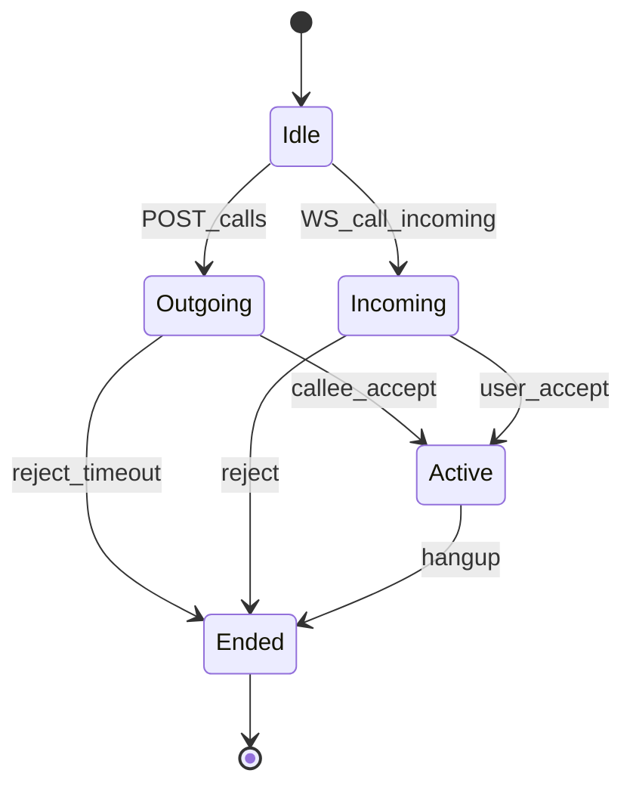

# Call Signaling

## 1. States



Maps to UI [doc_UI/21-call.md](../doc_UI/21-call.md) — window 0.

## 2. REST flow

### Initiate

```http
POST /v1/calls
{
  "chat_id": "uuid",
  "callee_ids": ["uuid"],
  "media": "audio|video",
  "type": "direct|group"
}
```

Response:

```json
{
  "call_id": "uuid",
  "livekit_url": "wss://rtc.tima.example",
  "token": "...",
  "room_name": "call_{uuid}"
}
```

### Accept

```http
POST /v1/calls/{call_id}/accept
→ { "token": "..." }
```

### Reject / End

```http
POST /v1/calls/{call_id}/reject
POST /v1/calls/{call_id}/end
```

## 3. WS events

- `call.incoming` — push + WS to callees
- `call.ended` — all participants
- `call.participant_joined` — group UI grid update

## 4. Group calls

- Max participants: 20+ (configurable, LiveKit `max_participants`).
- SFU mode always.
- Speaker detection: LiveKit API subscription.

## 5. Voice chat vs call

| Feature | Аудиочат [07](../doc_UI/07-voice-chat.md) | Call [21](../doc_UI/21-call.md) |
|---------|---------------------------------------------|----------------------------------|
| Context | **Community** (mandatory); optional link to group/channel | From chat or phone book |
| Join | Open room (per voice chat ACL) | Invite/accept |
| UI slot | Window 0 | Window 0 |
| Token check | ACL on `voice_chat_id` | Call participants |

Same LiveKit infra, different room policies. Room name: `voice_{voice_chat_id}`.

### Voice chat join

```http
POST /v1/voice-chats/{voice_chat_id}/join
```

Server validates:

1. `community_id` membership (if required by visibility)
2. **Voice chat ACL** (join/speak) — independent of community subscription alone

Response:

```json
{
  "livekit_url": "wss://rtc.tima.example",
  "token": "...",
  "room_name": "voice_{uuid}"
}
```

### Auto-create community

```http
POST /v1/voice-chats
{
  "title": "Standup",
  "community_id": null
}
```

If `community_id` is null → server creates community + voice chat in one transaction. See [social-objects/audio-chat.md](../01-product/social-objects/audio-chat.md) § auto-create.

## 6. History

Stored in `call_history` table:

```text
call_id, chat_id, community_id, voice_chat_id, initiator, participants[], started_at, ended_at, media_type, missed
```

UI: [02-phone-home.md](../doc_UI/02-phone-home.md) tab «Звонки».

## 7. Busy handling

- If callee in active call → `call.busy` event to caller.
- Optional call waiting Phase 2.

## 8. Ссылки

- [social-objects/00-index.md](../01-product/social-objects/00-index.md)
- [livekit-integration.md](./livekit-integration.md)
- [push-payloads.md](../05-api/push-payloads.md)
