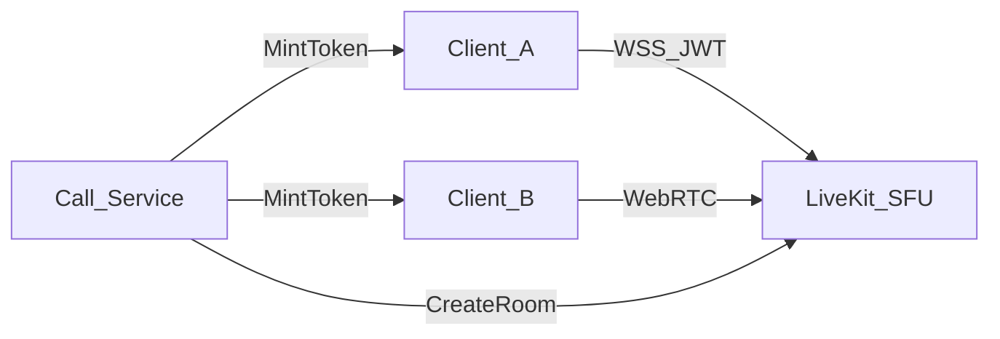

# LiveKit Integration

## 1. Role in TIMA

LiveKit provides **real-time audio/video** SFU. It does **not** replace Kodium for messages or async voice notes.

| Scenario | Technology |
|----------|------------|
| Live call 1:1 / group | LiveKit + SRTP |
| Voice message (async) | Kodium → MinIO |
| Voice chat room | LiveKit |
| Message E2E | Kodium |

## 2. Architecture



## 3. Server components

| Component | Source |
|-----------|--------|
| livekit-server | `livekit-master git/` |
| Redis | Required multi-node |
| TURN | Embedded or coturn |

## 4. Client SDKs

| Platform | SDK | Status |
|----------|-----|--------|
| Android | client-sdk-android | Planned |
| iOS | client-sdk-swift | Planned |
| Windows | official LiveKit C++ SDK 1.0 + narrow JNI/JNA adapter | Mandatory Communication MVP |

Windows SDK is encapsulated behind `CallRepository`: native SDK classes, callbacks and buffers do not cross the adapter boundary. The signed MSIX call E2E suite is a release gate.

## 5. Token minting (server-sdk-go)

```go
token := auth.NewAccessToken(apiKey, apiSecret).
  SetIdentity(userID).
  SetValidFor(5 * time.Minute).
  AddGrant(&auth.VideoGrant{
    RoomJoin: true,
    Room:     roomName,
  })
```

- Room name: `call_{call_id}` — not guessable.
- Permissions: publish/subscribe scoped.
- Signaling URL always uses `rtc.*`: `rtc.dev.*`, `rtc.beta.*`, `rtc.staging.*`, `rtc.*` production. API/realtime hostnames are not valid LiveKit endpoints.

## 6. Room lifecycle

| Event | Action |
|-------|--------|
| First accept | CreateRoom if not exists |
| Last participant leave | Empty timeout 300s (config) |
| Call end API | DeleteRoom optional |

## 7. 1:1 vs group

| Type | Mode | UI ref |
|------|------|--------|
| 1:1 | P2P preferred, SFU fallback | [21-call.md](../doc_UI/21-call.md) |
| Group ≤20+ | SFU always | same |

LiveKit handles ICE/TURN; clients should enable `allow_tcp_fallback`.

## 8. E2EE policy

**Application-level E2EE disabled v1** — see [ADR-0006](../adr/0006-livekit-media-policy.md).

LiveKit built-in E2EE **not enabled** in v1.

## 9. Webhooks

Configure LiveKit → Call Service:

- `room_started`, `room_finished`
- `participant_joined`, `participant_left`

Used for call history duration and billing metrics.

## 10. Vendor pinning

- Track upstream version in [dependency-policy.md](../09-delivery/dependency-policy.md).
- Protocol compatibility: match client SDK major to server.

## 11. Ссылки

- [call-signaling.md](./call-signaling.md)
- [livekit-operations.md](./livekit-operations.md)
- [recording-policy.md](./recording-policy.md)
