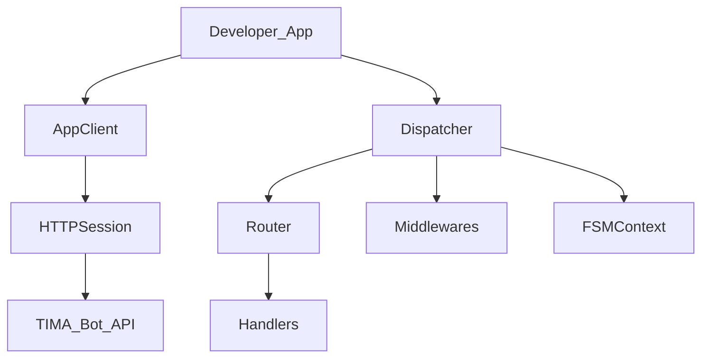

# Python Bot SDK (reference design)

> **Статус:** `planned` · **Версия:** 0.3 · **Дата:** 2026-07-22  
> **Пакет (planned):** `tima-bot-sdk` (PyPI, post-implementation Phase 3b)

Reference implementation по паттернам aiogram 3.x для **клиентской** стороны. Серверная policy enforcement остаётся в TIMA Bot Gateway.

## 1. Архитектура SDK



| Слой | Аналог aiogram | Роль |
|------|----------------|------|
| `AppClient` | `Bot` | Typed method calls |
| `PlatformMethod[T]` | `TelegramMethod[T]` | Request/response types |
| `Session` | `BaseSession` | HTTP, errors, retries |
| `Dispatcher` | `Dispatcher` | Update routing |
| `Router` | `Router` | Nested handlers |
| Filters | `Filter` | Match updates |
| Middleware | outer/inner | Logging, rate limit, errors |
| `FSMContext` | `FSMContext` | App conversation state (Redis) |

**FSM не является message SoT** — только ephemeral state для multi-step flows.

## 2. AppClient

```python
from tima_bot import AppClient
from tima_bot.methods import SendSocialInboxMessage, PublishChannelPost
from tima_bot.types import DocumentV2

async with AppClient(token="...") as client:
    app = await client(GetApp())
    result = await client(
        SendSocialInboxMessage(
            installation_id="...",
            target_id="...",
            recipient_user_id="...",
            document=DocumentV2(
                nodes=["Ваш заказ готов"],
                markup={"layout": {"type": "document", "children": [{"type": "paragraph", "nodes": [0]}]}},
                metadata={"format_version": 2, "revision_number": 1, "content_mode": "public"},
            ),
        )
    )
```

- `await client(method)` — аналог `await bot(method)`.
- `installation_id` обязателен на write methods.
- Нет `sender_id` / `author_id` в public API SDK.

## 3. Session & errors

```python
from tima_bot.exceptions import (
    BotPrivateMessagingForbidden,
    BotAuthorForbidden,
    InstallationTargetMismatch,
    BotRateLimited,
)

# Session.check_response() maps HTTP → typed exceptions
```

## 4. Dispatcher & Router

```python
from tima_bot import Dispatcher, Router, F
from tima_bot.types import Update

router = Router(name="orders")

@router.callback_query(F.data.startswith("order:"))
async def on_order_callback(callback: CallbackQuery, client: AppClient):
    order_id = callback.data.split(":")[1]
    await client(AnswerCallbackQuery(callback_query_id=callback.id, text="Принято"))
    # ...

dp = Dispatcher()
dp.include_router(router)

async def main():
    await dp.start_polling(client)  # or start_webhook(aiohttp_app, path="/webhook")
```

- `feed_update(client, update)` — entry point.
- First-match handler wins (как aiogram `TelegramEventObserver.trigger`).
- `UNHANDLED` / `SkipHandler` sentinels.

## 5. Filters

```python
@router.message(F.installation.target.type == "channel")
async def channel_only(message: Message): ...

@router.message(Command("start"))
async def cmd_start(message: Message, state: FSMContext): ...
```

- `Command`, `MagicData`, `StateFilter` — по образцу aiogram.
- Filter может enrich context: `return {"order_id": ...}`.

## 6. Middleware

```python
dp.update.outer_middleware(LoggingMiddleware())
dp.update.outer_middleware(ErrorMiddleware(dp.errors))
dp.message.middleware(InstallationContextMiddleware())
```

| Scope | Use |
|-------|-----|
| outer | Auth, logging, global errors |
| inner | Per-handler enrichment |

## 7. FSM

```python
class OrderForm(StatesGroup):
    waiting_address = State()

@router.message(OrderForm.waiting_address)
async def process_address(message: Message, state: FSMContext):
    await state.update_data(address=message.text)
    await state.clear()
```

- `StorageKey(bot_id=app_id, chat_id=installation_id, user_id=user_id)`.
- Backends: `MemoryStorage` (dev), `RedisStorage` (prod).
- **Не** хранить message bodies в FSM data long-term.

## 8. Webhook server (aiohttp)

```python
from aiohttp import web
from tima_bot.webhook import setup_webhook_routes

app = web.Application()
setup_webhook_routes(app, dispatcher=dp, client=client, path="/tima/webhook")
```

- Verify `X-TIMA-Webhook-Secret`.
- Fast ACK + background `feed_update` (как aiogram `aiohttp_server`).

## 9. Codegen

- OpenAPI schema TIMA Bot API → Python types/methods (butcher-style).
- **Never hand-edit** generated `methods/` and `types/`.

## 10. Ограничения SDK

SDK **не обходит** server policy:
- Нельзя вызвать private DM — метод не существует.
- `author` всегда server-derived.
- E2E methods отсутствуют.
- Bot SDK использует только public `DocumentV2`: required `metadata` (`format_version=2`, положительный `revision_number`, `content_mode=public`) и optional `nodes` / `markup`; `encrypted_nodes` / `encrypted_metadata` отсутствуют.
- Encode опускает отсутствующие optional-поля; decode нормализует `null`, `[]` и `{}` в отсутствие. Private/public fields не смешиваются.
- Media-only документ опускает `nodes`; полностью пустой документ и один пустой layout отклоняются по `has_content`. Групповой вызов дополнительно проверяет `content_mode` против режима группы.
- Private `text_link.secret_ref` и шифрование пустого metadata object в Bot SDK недоступны, поскольку private-контур отсутствует.
- Executable nodes и attachments отклоняются typed error.
- Media следует private/public dual pipeline; public media возвращает ровно три варианта без `Original`.
- Получение presigned URL требует auth; TTL URL — 15 минут.
- Edit создаёт immutable revision; dispatcher доставляет `message.edited`, не заменяя ранее доставленный объект сообщения.
- Retention и legal hold enforced сервером и не обходятся SDK.

## 11. Ссылки

- [domain-api-formats.md](./domain-api-formats.md)
- [bot-api.md](../05-api/bot-api.md)
- [bot-objects.md](../05-api/bot-objects.md)
- [bot-updates.md](../05-api/bot-updates.md)
- [bot-platform.md](../02-architecture/bot-platform.md)
